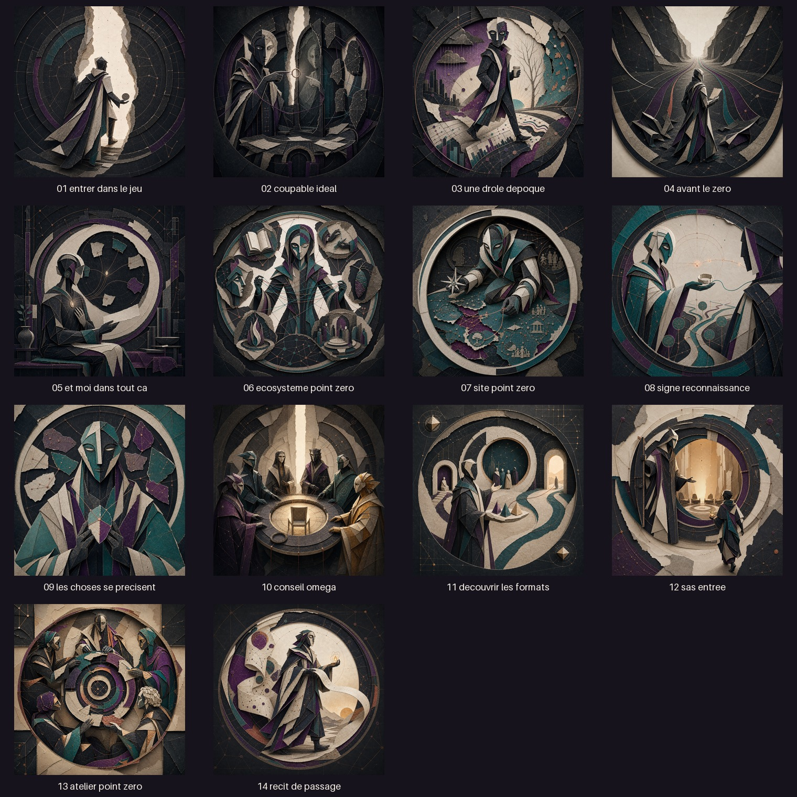

# Monde 0 — série archétypale des expériences

> Série créée par Codex le 27 juillet 2026 avec l'outil intégré de génération d'images, à partir
> des illustrations du procès du `Coupable idéal` utilisées uniquement comme références de style.
> Aucun visuel n'a été déployé dans l'application à cette étape.



## Intention

Remplacer l'iconographie hétérogène du parcours du Monde 0 par une famille immédiatement
reconnaissable : des figures archétypales monumentales, constituées de papier déchiré et de
formes en bas-relief, dans la continuité visuelle du procès du `Coupable idéal`.

La série ne reprend ni le procureur, ni l'avocat, ni les personnages narratifs d'`Une drôle
d'époque`. Chaque expérience possède son propre archétype et son propre geste.

La lumière suit la progression du parcours :

- **Je pressens** : graphite, fissure ivoire, violet profond ; le monde s'ouvre et se questionne ;
- **Je relie** : davantage de turquoise oxydé et de fils cuivrés ; les fragments deviennent une
  constellation ;
- **Je prends place** : l'ivoire et l'ambre gagnent du terrain ; la conscience s'incarne dans le
  conseil, la rencontre, l'atelier et le passage.

## Correspondance avec les expériences

| Ordre | Challenge | Expérience | Fichier | Archétype et geste |
|---:|---:|---|---|---|
| 1 | 236 | Le Point Zéro : entrer dans le Jeu | `01-entrer-dans-le-jeu-v1.png` | **Le Passeur du Seuil** entrouvre le monde et porte la spirale encore silencieuse. |
| 2 | 257 | Le Coupable idéal | `02-coupable-ideal-v1.png` | **L'Accusateur réfléchi** pointe les fragments ; son reflet ramène le geste vers lui. |
| 3 | 238 | Une drôle d'époque | `03-une-drole-depoque-v1.png` | **Le Somnambule éveillé** traverse une normalité disloquée, un œil fermé et l'autre ouvert. |
| 4 | 237 | Avant le Zéro | `04-avant-le-zero-v1.png` | **Le Voyageur des futurs** se tient au goulot de plusieurs chemins et abandonne une ancienne enveloppe. |
| 5 | 239 | Et moi dans tout ça ? | `05-et-moi-dans-tout-ca-v1.png` | **L'Écoute intérieure** reconnaît la graine lumineuse sans figer son récit. |
| 6 | 248 | L'écosystème Point Zéro | `06-ecosysteme-point-zero-v1.png` | **La Tisseuse de constellation** relie livres, pratiques, Chrysalides, experts et rencontres sans les centraliser. |
| 7 | 241 | Le site du Point Zéro | `07-site-point-zero-v1.png` | **Le Cartographe vivant** enquête, choisit deux fragments et révèle un lien possible. |
| 8 | 242 | Le signe de reconnaissance | `08-signe-reconnaissance-v1.png` | **La Messagère du lien libre** tend un signe dont le fil reste ouvert au consentement. |
| 9 | 243 | Les choses se précisent | `09-les-choses-se-precisent-v1.png` | **Le Gardien de constellation** assemble trois résonances en une première graine. |
| 10 | 254 | Le Conseil Oméga | `10-conseil-omega-v1.png` | **Le Conseil de la chaise vide** place l'absent, le futur et l'œuvre au centre de l'arbitrage. |
| 11 | 244 | Découvrir les formats | `11-decouvrir-les-formats-v1.png` | **Le Guide des passages** présente plusieurs portes sans décider à la place du joueur. |
| 12 | 245 | Le sas d'entrée | `12-sas-entree-v1.png` | **L'Hôte du Seuil** ouvre le passage vers un cercle humain et accueille une intention. |
| 13 | 246 | Vivre l'Atelier Point Zéro | `13-atelier-point-zero-v1.png` | **Les Co-bâtisseurs** composent ensemble une forme ouverte ; aucune main ne possède l'œuvre. |
| 14 | 247 | Mon récit de passage | `14-recit-de-passage-v1.png` | **Le Scribe du passage** transforme les traces du chemin en graine, puis laisse la suite blanche. |

## Format et usage applicatif

- source : PNG carré, 1254 × 1254 px ;
- composition centrée et lisible dans le recadrage circulaire de `challenge.photo` ;
- le même fichier peut être chargé dans `challenge.cover` : `cover_scene` le contient sans
  recadrage destructif sur la fiche 16:9 et construit son arrière-plan diffus ;
- aucun texte incrusté, logo ou élément dépendant d'une langue ;
- conserver les noms versionnés tant que Boris n'a pas validé la série en situation réelle ;
- la planche JPG sert à l'arbitrage, pas à l'application.

## Prompt matrice utilisé

```text
Use case: stylized-concept
Asset type: square experience cover and circular journey medallion for Point Zéro, Monde 0.
Input images: the Coupable idéal prosecutor, advocate and Real illustrations are style references
only. Match their sophisticated neoarchaic handcrafted paper-collage language: tactile torn
fibers, layered bas-relief, monumental masked archetypes, matte graphite black, warm ivory, deep
violet, oxidized teal, and fine copper constellation lines. Do not copy their characters.
Composition: square 1:1, one dominant archetypal scene readable in a circular center crop, with
enough surrounding structure to work as a contained 16:9 cover.
Constraints: original adult archetypes; no text, letters, numbers, logos or watermark; no
photorealism, cute style, medieval fantasy, generic sci-fi armor, neon or direct religious
iconography.
```

À cette matrice s'ajoutent, pour chaque image, l'archétype et le geste décrits dans le tableau.
Les prompts de `Je relie` demandent davantage de turquoise et de connexions cuivrées ; ceux de
`Je prends place` introduisent plus d'ivoire, de cuivre ancien et de lumière ambre.

## Références de style

- `../coupable-ideal/proces-procureur-archetype-v1.png` ;
- `../coupable-ideal/proces-avocat-archetype-v1.png` ;
- `../coupable-ideal/proces-le-reel-v1.png`.

Ces images ont guidé la matière, la palette et la monumentalité. Elles ne sont ni des cibles à
modifier ni une banque de personnages à réutiliser.

## Vérifications réalisées

- 14 fichiers présents, un par expérience actuellement incluse dans le parcours ;
- 14 images carrées en 1254 × 1254 px ;
- aucun texte généré dans les scènes ;
- sujet principal lisible dans le centre circulaire ;
- variation colorimétrique progressive sans rupture de style ;
- aucune image actuelle du serveur écrasée ;
- aucun déploiement ni changement de base effectué.
