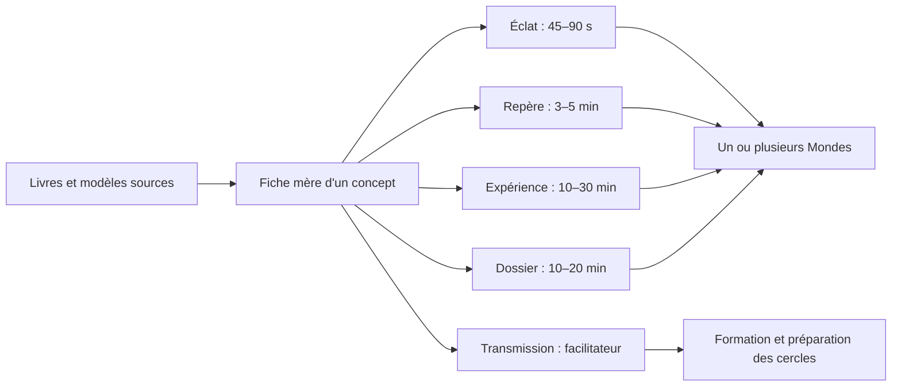

# Ressourcerie Point Zéro — carte des fiches par Monde

> Cartographie éditoriale proposée par Codex le 27 juillet 2026, à partir des dossiers
> `Ressources Point Zero/Modèles`, `Ressources Point Zero/Livres` et du corpus vidéo
> `Vidéos/Capsules PZ - Monde 1-avec questions.docx`.
>
> Ce document organise le corpus ; il ne canonise pas à lui seul la nomenclature détaillée des
> Mondes 7 à 10.

## 1. Décision proposée

La Ressourcerie ne devrait pas reproduire la structure des livres. Elle devrait transformer leur
matière en **fiches pédagogiques courtes, reliées entre elles et réutilisables dans plusieurs
Mondes**.

Un concept n'appartient donc pas définitivement à un seul Monde :

- un Monde l'**introduit**, avec le degré de complexité utile au joueur à cet instant ;
- un autre Monde le **réactive** dans une situation plus engageante ;
- un troisième peut l'**approfondir** à l'échelle collective ou systémique ;
- la formation des facilitateurs en propose enfin une version de **transmission**, avec sources,
  limites et précautions.

Exemple : le **Moteur ontologique** peut être pressenti au Monde 0, compris au Monde 1, observé
dans la relation au Monde 2, traversé dans l'Ombre au Monde 3, mobilisé dans l'action au Monde 4,
puis utilisé comme grille de facilitation à partir du Monde 6.



## 2. Ce qui a été scanné

### 2.1 Modèles visuels

Le dossier `Ressources Point Zero/Modèles` contient **97 images** : 69 PNG et 28 JPG. Elles se
répartissent en neuf ensembles éditoriaux :

1. Marelle et fiches-Mondes : huit fiches couvrant les Mondes 0 à 6, puis 7 à 10, plus la carte
   générale de la Marelle ;
2. Moteur, Triade, Source/Ombre/Lumière et deux plans du réel ;
3. sept Puissances, émotions, croyances, décision et redécision ;
4. PsychoKernel, cinq cadres, écologies interne et externe, événements et besoins ;
5. Voyage du héros, archétypes, chakras et Assemblée des Avatars ;
6. Empire, Cité Cosmique, civilisations, néoarchaïsme et masculin/féminin ;
7. niveaux de conscience, hyperconscience, pouvoir et cycles ;
8. scénarios prospectifs, diffusion des innovations, stratégie et Scénario Oméga ;
9. CosmoCoin, cosmogenèse, fractale et cartes des savoirs.

### 2.2 Livres

Les quatre livres représentent environ **3,66 millions de caractères** et ont été indexés par
titres puis lus thématiquement :

| Source | Fonction principale dans la Ressourcerie |
|---|---|
| `Archétypes.docx` | Grammaire archétypale, 42 archétypes, Moteur, sept Puissances, plans implicite/explicite, technologies de conscience. |
| `PRT-Le Point Zéro - Livre I.docx` | Diagnostic civilisationnel : cycles, crises, récits, 25 scénarios, PsychoKernel, cinq cadres, angles morts, crisologie et théorie Oméga. |
| `PRT-Le Point Zéro - Livre II.docx` | Architecture proprement Point Zéro : Empire/Cité, dix vagues, Triade, Moteur, sept Puissances, Marelle, néoarchaïsme, redécision et économie Oméga. |
| `PRT-Le Point Zéro - Livre III.docx` | Mise en œuvre systémique : cinq transitions, savoirs, organisations, communautés, économie, métastratégie, phases 2000–2100 et pratiques avancées. |

### 2.3 Corpus vidéo déjà prévu

La version la plus complète retrouvée est
`Vidéos/Capsules PZ - Monde 1-avec questions.docx`. Les trois autres fichiers `Capsules PZ -
Monde 1*.docx` sont des variantes ou états antérieurs. Ce corpus prévoit déjà des capsules sur :

- le Point Zéro, l'intercycle, la civilisation, son effondrement et la fenêtre 2050 ;
- les scénarios, les minorités créatives, les 10 %, les Chrysalides et la stratégie d'action ;
- les impensés du changement, les peuples premiers, le PsychoKernel, le pouvoir et les rites ;
- les récits Source/Néant, l'Empire, la Cité Cosmique, l'Ombre et le Jeu Cosmique ;
- la Marelle, le Voyage du héros, la Triade, les sept Puissances et les besoins ;
- la métastratégie, le Scénario Oméga, les communautés, la dixième vague, l'IA systémique,
  la monnaie Oméga et le passage à l'échelle.

Le script long du **Coupable idéal — La crise de nos récits**, documenté séparément, constitue
déjà le pont audiovisuel entre crise, récits, polarisation, polarités intérieures et Point Zéro.

## 3. Une fiche mère, cinq profondeurs

Chaque concept possède un identifiant stable et une seule fiche mère. L'interface n'affiche que
la profondeur adaptée au contexte.

| Profondeur | Promesse | Format indicatif | Usage |
|---|---|---:|---|
| **Éclat** | Une idée mémorisable, une tension, une question. | Réel de 45–90 s + 3 cartes | Découverte, partage, rappel dans un parcours. |
| **Repère** | Comprendre le concept sans devoir connaître le corpus. | Capsule de 3–6 min + fiche courte | Mondes 0–2 et Ressourcerie publique. |
| **Expérience** | Reconnaître le concept dans une situation réelle. | Exercice, QCM de discernement, dialogue ou mini-jeu de 10–30 min | Parcours joueur. |
| **Dossier** | Relier le concept aux autres éléments de la grammaire PZ. | Texte de 10–20 min, schémas, exemples et contre-exemples | Mondes avancés et joueurs curieux. |
| **Transmission** | Savoir l'introduire sans l'aplatir ni surinterpréter les personnes. | Guide facilitateur, sources, garde-fous, questions de cercle | Formation PZ. |

Principes d'UX :

- afficher d'abord la version appelée par l'expérience ;
- proposer ensuite `Approfondir`, sans bloquer la progression ;
- conserver un seul historique de lecture par concept, mais distinguer les profondeurs consultées ;
- montrer `Déjà rencontré au Monde…` et `Réinvesti ici pour…` ;
- ne jamais transformer la profondeur en niveau de valeur ou de conscience du joueur ;
- permettre à un facilitateur de basculer vers `Préparer cette ressource pour un cercle`.

## 4. Carte maîtresse des fiches

Légende vidéo : **Prévue** = déjà présente dans le corpus des capsules ; **Nouvelle** = format à
produire en complément ; **Longue** = vidéo qui demande plus qu'un Réel ; **Humain** = sujet à ne
pas faire valider par une vidéo ou un automatisme seul.

### 4.1 Voir la bascule civilisationnelle

| ID | Fiche mère | Introduite | Réinvestie | Profondeurs prioritaires | Vidéo | Modèles associés |
|---|---|---:|---|---|---|---|
| BAS-01 | Une crise systémique n'est pas une addition de problèmes | M0 | M1, M6–M9 | Éclat, Repère, Dossier | Prévue | `Courbes-3.png`, `Cycles-panneau-complet-4.png` |
| BAS-02 | Cycle, fin de cycle et intercycle | M0 | M1, M7–M9 | Éclat, Repère, Dossier | Prévue | `Cycle-Convergence-2.png`, `Civilisations.png` |
| BAS-03 | Une civilisation est d'abord un récit vivant | M0 | M1, M4, M9 | Repère, Expérience, Dossier | Prévue | `PsychoKernel-Recits-Planche-1.png` |
| BAS-04 | Pourquoi les civilisations cessent d'apprendre | M0 | M1, M7 | Éclat, Repère, Dossier | Prévue | `Good-times.png`, `hamster-3.jpg` |
| BAS-05 | Dix signes qu'un récit collectif ne tient plus | M0 | M1 | Éclat, Repère | Prévue | `Courbes-3.png`, `Phases-3.jpg` |
| BAS-06 | Le piège du coupable unique | M0 | M1, M3, M6 | Expérience, Dossier | Longue existante + nouveaux Réels | Roue du procès, `Cite-Cosmique-2.png` |
| BAS-07 | Se dépolariser n'est ni se neutraliser ni se placer au milieu | M0 | M1, M3–M6 | Éclat, Expérience, Transmission | Nouvelle | `Cite-Cosmique-2.png`, `Feminin-Masculin.png` |
| BAS-08 | Vingt-cinq futurs pour sortir du futur unique | M0 | M1, M7–M9 | Repère, Expérience, Dossier | Prévue | `Scenarios-livre-01.png` à `25.png` |
| BAS-09 | Transformer les structures et le logiciel intérieur | M0 | Tous | Repère, Expérience, Transmission | Nouvelle | `PsychoKernel-Recits-Planche-2.png`, `Fractale-Gradients-Manifestation.png` |

### 4.2 Lire le logiciel invisible

| ID | Fiche mère | Introduite | Réinvestie | Profondeurs prioritaires | Vidéo | Modèles associés |
|---|---|---:|---|---|---|---|
| LOG-01 | Le PsychoKernel : comment un récit devient un monde | M1 | M3, M4, M6–M9 | Repère, Dossier, Transmission | Prévue | `PsychoKernel-Recits-Planche-1.png`, `Planche-2.png` |
| LOG-02 | Les récits : orientation, identité et angle mort | M1 | M2, M4, M6, M9 | Repère, Expérience | Prévue | `PsychoKernel-Recits-Planche-1.png` |
| LOG-03 | Une croyance n'est pas une erreur : c'est une compression du réel | M1 | M3, M4 | Éclat, Expérience, Dossier | Nouvelle | `Croyances-01.jpg` à `06.jpg` |
| LOG-04 | Croyance, décision, redécision | M1 | M3–M5 | Repère, Expérience, Transmission | Nouvelle | `Décision-redécision.png`, `Croyances-2-etats.jpg` |
| LOG-05 | Les cinq cadres qui rendent une action possible | M1 | M2, M4, M6–M9 | Repère, Dossier, Transmission | Nouvelle série | `Cartes-Cadres.jpg` |
| LOG-05R | Cadre relationnel : de la sécurité à la vulnérabilité | M1 | M2–M4, M6 | Expérience, Transmission | Nouvelle | `Cartes-Cadres.jpg` |
| LOG-05S | Cadre de sens : de la direction à l'orientation | M1 | M4, M6–M9 | Expérience, Transmission | Nouvelle | `Cartes-Cadres.jpg` |
| LOG-05G | Cadre de gouvernance : du contrôle à l'équité | M1 | M2, M6–M9 | Expérience, Transmission | Nouvelle | `Cartes-Cadres.jpg` |
| LOG-05O | Cadre opérationnel : de l'agitation à l'action | M1 | M4–M9 | Expérience, Transmission | Nouvelle | `Cartes-Cadres.jpg` |
| LOG-05A | Cadre d'apprenance : de la certitude à la sagesse | M1 | Tous | Expérience, Transmission | Nouvelle | `Cartes-Cadres.jpg` |
| LOG-06 | Écologie interne et écologie externe | M1 | M3, M4, M6 | Repère, Dossier | Nouvelle | `Cartes-Ecologie-interne.jpg`, `Cartes-Ecologie-externe-1.jpg` |
| LOG-07 | Les événements qui cristallisent un système | M1 | M4, M6–M9 | Repère, Expérience | Nouvelle | `Cartes-Evenements.jpg` |
| LOG-08 | Les besoins de la personne et ceux du système | M1 | M2, M4, M6 | Repère, Expérience, Transmission | Prévue + Réel complémentaire | `5 besoins individu vs système.png` |
| LOG-09 | Pouvoir d'agir et niveau de conscience | M1 | M3, M6–M9 | Repère, Dossier, Transmission | Prévue | `Conscience-pouvoir.png` |

### 4.3 Apprendre la grammaire de Conscience

| ID | Fiche mère | Introduite | Réinvestie | Profondeurs prioritaires | Vidéo | Modèles associés |
|---|---|---:|---|---|---|---|
| GRA-01 | Deux plans du réel : observable et implicite | M1 | M3–M5, M7–M10 | Repère, Dossier | Nouvelle | `2-réels-2.jpg` |
| GRA-02 | La Triade : Lumière, Ombre, Source | M1 | M3–M10 | Repère, Expérience, Transmission | Prévue | `Moteur-ontologique-1.png` à `4.png` |
| GRA-03 | Le Moteur ontologique : une tension qui crée du mouvement | M1 | M2–M10 | Repère, Dossier, Transmission | Nouvelle | `Moteur-ontologique.png` |
| GRA-04 | Moteur harmonique et Moteur inversé | M1 | M3–M6 | Éclat, Expérience, Dossier | Nouvelle | `Moteur-Harmonique-inverti.png` |
| GRA-05 | Les sept Puissances : sept verbes pour retrouver le mouvement | M0 | Tous | Éclat, Repère, Dossier | Prévue + nouvelle série | `Archétypes-Chakras.png` |
| PUI-DES | Désir — « Je suis » : reconnaître l'énergie de l'existence | M1 | M3, M5 | Repère, Expérience | Nouvelle | `Archétypes-Chakras-Exemples-2.png` |
| PUI-VOL | Volonté — « Je veux » : agir sans se forcer | M1 | M4, M5 | Repère, Expérience | Nouvelle | `Archétypes-Chakras-Exemples-2.png` |
| PUI-IMA | Imagination — « Je crée » : ouvrir une forme qui n'existait pas | M1 | M4–M6 | Repère, Expérience | Nouvelle | `Archétypes-Chakras-Exemples-2.png` |
| PUI-EMO | Émotion — « J'aime » : laisser circuler sans être submergé | M1 | M2, M3, M5 | Repère, Expérience, Humain | Nouvelle | `Emotions.png` |
| PUI-COM | Communication — « J'exprime » : rendre la relation habitable | M1 | M2, M4, M6 | Repère, Expérience | Nouvelle | `Archétypes-Chakras-Exemples-2.png` |
| PUI-INT | Intuition — « Je connais » : discerner avant de conclure | M0 | M1, M4, M5 | Repère, Expérience | Nouvelle | `Archétypes-Chakras-Exemples-2.png` |
| PUI-TRA | Transcendance — « Je donne » : relier l'œuvre à plus vaste que soi | M1 | M5–M10 | Repère, Dossier, Transmission | Nouvelle longue | `Archétypes-Chakras.png` |
| GRA-06 | L'Ombre comme puissance séparée de la conscience | M1 | M3–M6 | Repère, Expérience, Humain | Prévue | `Croyances-2-etats.jpg`, `Cite-Cosmique-Empire.png` |
| GRA-07 | Émotions : signaux, énergie et mouvement | M1 | M2, M3, M5 | Repère, Expérience, Humain | Nouvelle | `Emotions.png` |
| GRA-08 | Le Point Zéro collectif et individuel | M0 | Tous | Éclat, Repère, Transmission | Nouvelle | `Fractale-Gradients-Manifestation.png` |

### 4.4 Traverser, créer et contribuer

| ID | Fiche mère | Introduite | Réinvestie | Profondeurs prioritaires | Vidéo | Modèles associés |
|---|---|---:|---|---|---|---|
| PAS-01 | La Marelle : une carte de passages, pas une échelle de valeur | M0 | Tous | Repère, Dossier, Transmission | Prévue | `10-mondes-Marelle.png`, fiches-Mondes |
| PAS-02 | Le Voyage du héros : quitter, traverser, rapporter | M1 | M2–M6 | Repère, Expérience | Prévue | `4-voyages-heros.png`, `Chakras-Voyage-1.png` |
| PAS-03 | Quatre voyages : conformité, inversion, individuation, alchimisation | M2 | M3–M6 | Dossier, Expérience, Transmission | Nouvelle longue | `4-voyages-heros.png` |
| PAS-04 | Le cercle comme miroir et non comme tribunal | M2 | M3–M6 | Éclat, Expérience, Transmission | Nouvelle | `Assemblee-Avatars-1.png` |
| PAS-05 | L'Assemblée intérieure des Avatars | M2 | M3–M5 | Expérience, Dossier, Humain | Nouvelle longue | `Assemblee-Avatars-1.png` à `4.png` |
| PAS-06 | Les archétypes : fonctions vivantes, pas étiquettes de personnalité | M2 | M3–M10 | Repère, Dossier, Transmission | Nouvelle | `Archétypes-Chakras.png` |
| PAS-07 | Masculin et féminin comme tension symbolique | M3 | M4–M6 | Dossier, Expérience, Humain | Nouvelle longue | `Feminin-Masculin.png` |
| PAS-08 | Le néoarchaïsme : retrouver la fonction sans restaurer l'ancien monde | M4 | M5–M9 | Repère, Dossier | Nouvelle | `Neoarchaisme.png` |
| PAS-09 | De l'intention à l'incarnation | M4 | M5, M6 | Expérience, Dossier | Nouvelle | `Chakras-Voyage-3.png`, `Onde.png` |
| PAS-10 | Jouer avec le système sans se trahir | M4 | M5, M6 | Éclat, Expérience | Nouvelle | fiche Monde 4 |
| PAS-11 | Fluidité, champ et synchronicité : hypothèses d'expérience | M5 | M6–M10 | Dossier, Expérience, Transmission | Nouvelle longue | `Onde.png`, `Hyperconscience.png` |

### 4.5 Habiter et transformer les systèmes

| ID | Fiche mère | Introduite | Réinvestie | Profondeurs prioritaires | Vidéo | Modèles associés |
|---|---|---:|---|---|---|---|
| SYS-01 | Empire et Cité Cosmique : mêmes polarités, circulation différente | M1 | M3, M4, M6–M9 | Repère, Expérience, Dossier | Prévue + nouveau Réel | `Cite-Cosmique-2.png`, `Cite-Cosmique-Empire.png` |
| SYS-02 | Intégration et dissociation d'un système vivant | M1 | M3–M6 | Éclat, Expérience, Transmission | Nouvelle | `Cite-Cosmique-2.png` |
| SYS-03 | Chrysalides : graines du nouveau monde et risque de recapture | M0 | M1, M4, M6–M9 | Repère, Dossier | Prévue | `Diffusion-innovations.png` |
| SYS-04 | Niveaux de conscience systémiques | M6 | M7–M9 | Dossier, Transmission | Nouvelle longue | `Niveaux-conscience-systemiques.png` |
| SYS-05 | Les cinq transitions : savoir, humain, organisation, économie, civilisation | M6 | M7–M9 | Repère, Dossier | Nouvelle série | `Carte-savoirs.png` |
| SYS-06 | Crisologie : ce qu'une crise révèle et rend possible | M6 | M7–M9 | Repère, Dossier | Nouvelle | `Crisologie.jpg` |
| SYS-07 | Dix vagues technospirituelles | M6 | M7–M9 | Dossier | Prévue partiellement | `10-vagues-1.png`, `10-vagues-2.png` |
| SYS-08 | Comment une innovation devient une norme | M6 | M7–M9 | Repère, Dossier | Prévue | `Diffusion-innovations.png` |
| SYS-09 | Les cinq phases 2000–2100 : scénario de travail, pas prophétie | M6 | M7–M9 | Dossier, Transmission | Nouvelle longue | `Phases-3.jpg` |
| SYS-10 | Métastratégie et Scénario Oméga | M7 | M8, M9 | Dossier, Transmission | Prévue | `Scenario-Omega_Etapes.png`, `Strateges-1.jpg` |
| SYS-11 | Économie contributive et CosmoCoin | M6 | M8, M9 | Repère, Dossier | Prévue | `CosmoCoin.png` |
| SYS-12 | La carte des savoirs et la pensée harmonique | M7 | M8, M9 | Dossier, Transmission | Nouvelle longue | `Carte-savoirs.png` |
| SYS-13 | Cosmogenèse, fractale et Jeu Cosmique | M7 | M8–M10 | Dossier, Transmission | Prévue partiellement | `Cosmogenese.jpg`, `Fleurs-vie.png` |
| SYS-14 | Hyperconscience et conscience souveraine | M7 | M8–M10 | Dossier, Transmission | Nouvelle longue | `Hyperconscience.png`, fiche Mondes 7–10 |

## 5. Ventilation éditoriale par Monde

Cette vue indique ce que le joueur a besoin de rencontrer **à cet endroit du parcours**. Elle ne
signifie pas que les autres fiches lui sont interdites dans la Ressourcerie.

### Monde 0 — L'Empire inconscient

**Question vécue :** « Je sais que quelque chose ne va pas, sans encore savoir le lire. »

Priorité : BAS-01 à BAS-09, GRA-05 en aperçu, GRA-08, PAS-01 et SYS-03.

- faire sentir la convergence des crises sans noyer sous les causes ;
- montrer que les récits collectifs structurent ce que nous pouvons imaginer ;
- introduire le piège du coupable unique et la symétrie collectif/individuel ;
- faire du Point Zéro une porte de discernement, pas une doctrine déjà maîtrisée.

Formats dominants : vidéo, Réel, mini-jeu, récit, QCM de repérage, auto-observation légère.

À éviter : les systèmes archétypaux complexes, les diagnostics individuels, la cosmologie
présentée comme un fait et le jargon complet du corpus.

### Monde 1 — L'éveil cognitif

**Question vécue :** « Avec les autres, je commence à voir les cadres invisibles et à reprendre
du pouvoir d'agir. »

Priorité : LOG-01 à LOG-09, GRA-01 à GRA-08, PAS-01, PAS-02 et SYS-01.

- nommer le PsychoKernel et ses cinq composants ;
- découvrir les sept Puissances sans en faire un test de personnalité ;
- relier besoins individuels, besoins du système et cadres de coopération ;
- produire de premiers blocs ou graines de récit avec un mentor IA.

Formats dominants : fiches Repère, capsules, schémas annotés, QCM de discernement, dialogue IA,
premières productions personnelles.

### Monde 2 — L'alignement intérieur

**Question vécue :** « Je me découvre dans un collectif suffisamment sûr pour devenir un miroir. »

Priorité : LOG-05R, LOG-05G, LOG-08, PUI-COM, PUI-EMO, PAS-02 à PAS-06.

- comprendre la relation comme espace d'apprentissage ;
- entrer dans le Voyage du héros et le cercle de croissance ;
- apprendre la parole, l'écoute, le feedback et la responsabilité ;
- reconnaître plusieurs voix intérieures sans les figer en identités.

Formats dominants : expériences de cercle, fiches-outils, préparation vidéo courte, débrief humain.

### Monde 3 — La traversée de l'Ombre

**Question vécue :** « Ce que je rejetais agit aussi en moi. »

Priorité : BAS-06, BAS-07, LOG-03, LOG-04, LOG-06, GRA-04, GRA-06, GRA-07, PAS-05 à PAS-07.

- distinguer désir, puissance, pouvoir et domination ;
- reconnaître projections, croyances défensives et parts séparées ;
- travailler avec les émotions et le corps sans promesse thérapeutique ;
- réintroduire les polarités refusées sans nier les asymétries ni les violences.

Formats dominants : préparation conceptuelle courte puis dispositif humain sécurisé.

Garde-fou : aucune fiche, vidéo, IA ou QCM ne valide seule une traversée intime. Les contenus
préparent, nomment et aident à relire ; ils ne diagnostiquent ni ne remplacent un professionnel.

### Monde 4 — L'alchimisation de l'Empire

**Question vécue :** « Je peux transformer sans m'opposer mécaniquement à ce qui est. »

Priorité : LOG-02 à LOG-07, PUI-VOL, PUI-IMA, PUI-COM, PAS-03, PAS-08 à PAS-10.

- passer de la dénonciation à une action qui intègre le réel ;
- travailler les récits et croyances profondes dans des situations concrètes ;
- distinguer compromis, compromission et alchimisation ;
- relier présence, parole, création et œuvre collective.

Formats dominants : études de cas, simulations, journal d'expérience, création et retour de pairs.

### Monde 5 — La fluidité du Jeu

**Question vécue :** « Je peux laisser circuler davantage sans abandonner mon discernement. »

Priorité : PUI-DES, PUI-VOL, PUI-IMA, PUI-TRA, PAS-06, PAS-08, PAS-09 et PAS-11.

- stabiliser la capacité à accueillir désir, émotion, intuition et création ;
- explorer le champ et la synchronicité comme expériences à interroger, non comme preuves ;
- travailler avec les personas et les archétypes sans essentialiser ;
- éprouver la grammaire PZ dans le quotidien : travail, argent, corps, relation.

Formats dominants : pratiques artistiques, protocoles d'attention, journaux de bord, dossiers
optionnels et cercles expérimentés.

### Monde 6 — La Cité Cosmique

**Question vécue :** « Nous pouvons devenir le système vivant que nous cherchons. »

Priorité : LOG-05, LOG-08, LOG-09, SYS-01 à SYS-09 et SYS-11.

- appliquer les cinq cadres à la gouvernance, à l'économie, à l'éducation et au soin ;
- observer comment les polarités circulent ou se figent dans un collectif ;
- transformer une Chrysalide en structure apprenante plutôt qu'en nouvel Empire ;
- relier territoire, communauté, réseaux et évaluation systémique.

Formats dominants : cas collectifs, canevas, cartes de tensions, laboratoires territoriaux,
formation avancée à la facilitation.

### Mondes 7 à 10 — La conscience souveraine

La fiche visuelle source regroupe actuellement ces quatre Mondes sous une seule promesse :
**« Le Jeu se révèle à lui-même »**. Les documents pédagogiques donnent des indications plus
fines, mais pas encore une nomenclature produit définitivement arbitrée. La ventilation suivante
est donc **provisoire** :

| Monde | Fonction éditoriale proposée | Fiches dominantes |
|---:|---|---|
| **7** | Lire et agir dans les organisations et systèmes complexes. | SYS-04 à SYS-08, SYS-10, SYS-12 |
| **8** | Relier les transitions, territoires et architectures de civilisation. | SYS-05, SYS-07 à SYS-13 |
| **9** | Mettre puissance, stratégie et économie au service d'une œuvre collective. | SYS-08 à SYS-13 |
| **10** | Transmettre, régénérer le Jeu et revenir à la Source sans s'approprier le cadre. | GRA-02, GRA-08, PAS-01, SYS-13, SYS-14 |

Décision à prendre avant intégration dans l'application : soit conserver un espace éditorial
commun 7–10 avec recommandations personnalisées, soit nommer et spécifier séparément ces quatre
Mondes. En l'état, la première solution est la plus fidèle au matériau visuel disponible.

## 6. Programme vidéo complémentaire

### 6.1 Ce qu'il ne faut pas refaire

Les futures productions doivent d'abord réutiliser les capsules déjà écrites sur le Point Zéro,
l'intercycle, les civilisations, le PsychoKernel, le pouvoir et la conscience, les rites, les
Chrysalides, la diffusion, les récits, Empire/Cité, l'Ombre, la Marelle, le Voyage du héros, la
Triade, les Puissances, les besoins et Oméga.

Pour chacune, la première tâche éditoriale consiste à :

1. isoler le script canonique parmi les variantes du DOCX ;
2. lui attribuer un identifiant de fiche ;
3. produire une version horizontale de 3–6 minutes ;
4. dériver, si utile, un Réel autonome de 45–90 secondes ;
5. écrire la question de passage vers l'expérience, pas seulement une conclusion informative.

### 6.2 Nouvelles vidéos prioritaires

| Priorité | Titre de travail | Format | Fiche | Rôle pédagogique |
|---:|---|---:|---|---|
| P0 | **Le Point Zéro n'est pas le milieu** | Réel 60 s | BAS-07 | Distinguer intégration, compromis mou et fausse équivalence. |
| P0 | **Une fonction n'est pas une innocence** | Réel 60 s | BAS-06 | Conserver ce qu'un système rend possible sans excuser ses dommages. |
| P0 | **Le contraire n'est pas encore une solution** | Réel 60 s | BAS-06 | Montrer comment un récit compensatoire recrée un déséquilibre. |
| P0 | **Le monde dehors, le monde dedans : un même mouvement** | Capsule 3 min | BAS-09, GRA-08 | Installer la symétrie Point Zéro collectif/individuel. |
| P0 | **Une croyance est une compression du réel** | Réel 75 s | LOG-03 | Faire reconnaître l'utilité et l'angle mort d'une croyance. |
| P0 | **Le Moteur : quand une tension recommence à circuler** | Capsule 4 min | GRA-03, GRA-04 | Donner une première image concrète du Moteur harmonique/inversé. |
| P0 | **Sept verbes pour retrouver le mouvement** | Capsule 4 min | GRA-05 | Vue d'ensemble mémorisable des sept Puissances. |
| P1 | **Une Puissance, deux devenirs** | 7 Réels de 60–90 s | PUI-* | Pour chaque Puissance : fonction, capture, geste d'intégration. |
| P1 | **Cinq cadres, cinq questions avant d'agir** | 1 capsule + 5 Réels | LOG-05* | Relier vulnérabilité, orientation, équité, action et sagesse. |
| P1 | **Quand les besoins du système étouffent ceux des personnes** | Capsule 4 min | LOG-08 | Rendre la matrice des besoins immédiatement utilisable. |
| P1 | **Le cercle n'est pas un tribunal** | Réel 75 s | PAS-04 | Préparer l'entrée au Monde 2 et le feedback. |
| P1 | **Quatre Voyages du héros** | Capsule 6–8 min | PAS-03 | Distinguer voyage conforme, inversé, d'individuation et d'alchimisation. |
| P1 | **L'Ombre n'est pas le mal** | Capsule 4 min | GRA-06 | Préparer le Monde 3 avec les garde-fous nécessaires. |
| P1 | **Transformer sans s'opposer** | Réel 75 s | PAS-10 | Faire sentir le geste spécifique du Monde 4. |
| P2 | **Archétype ou étiquette ?** | Réel 75 s | PAS-06 | Éviter la réification des figures archétypales. |
| P2 | **La Cité et l'Empire ont les mêmes polarités** | Capsule 5 min | SYS-01, SYS-02 | Montrer que la différence tient à la circulation, pas au choix du bon camp. |
| P2 | **Une Chrysalide peut-elle recréer l'Empire ?** | Capsule 4 min | SYS-03 | Installer une capacité d'auto-observation des collectifs émergents. |
| P2 | **Une crise révèle le cadre qui ne sait plus apprendre** | Capsule 4 min | SYS-06 | Introduire la crisologie sans catastrophisme. |
| P3 | **Les cinq transitions se parlent** | Série de 5 capsules | SYS-05 | Articuler les domaines épistémologique, humain, organisationnel, économique et civilisationnel. |
| P3 | **Les phases du Point Zéro : scénario, pas prophétie** | Capsule 6 min | SYS-09 | Poser le statut hypothétique du calendrier 2000–2100. |

### 6.3 Règle de production

Une nouvelle vidéo n'est justifiée que si elle accomplit au moins une fonction absente du corpus :

- **rendre sensible** une idée trop abstraite dans le livre ;
- **mettre en tension** deux lectures au lieu d'énoncer une doctrine ;
- **préparer une expérience** ou un échange en cercle ;
- **donner un garde-fou** indispensable à l'usage d'un concept ;
- **relier deux Mondes** en montrant comment le même concept change de profondeur.

Pour les archétypes, l'Ombre, les émotions profondes, les états élargis de conscience et le
masculin/féminin symbolique, la vidéo reste une préparation. Elle ne doit pas constituer à elle
seule une validation d'expérience.

## 7. Modèle de données éditorial minimal

Sans présumer de l'implémentation Rails, chaque fiche devrait pouvoir être décrite par :

```yaml
id: GRA-03
slug: moteur-ontologique
title: "Le Moteur ontologique"
family: grammaire_conscience
status: draft
source_files:
  - "Ressources Point Zero/Livres/PRT-Le Point Zéro - Livre II.docx"
  - "Ressources Point Zero/Modèles/Moteur-ontologique.png"
world_uses:
  - world: 1
    role: introduce
    depth: repere
  - world: 3
    role: experience
    depth: experience
  - world: 6
    role: facilitate
    depth: transmission
media:
  - kind: capsule
    status: to_produce
    title: "Le Moteur : quand une tension recommence à circuler"
safety:
  claims_status: symbolic_model
  human_debrief_required: false
related:
  - GRA-02
  - GRA-04
  - GRA-05
```

Champs indispensables : source, statut épistémique (`fait sourcé`, `hypothèse`, `modèle
symbolique`, `vision PZ`), Monde et fonction, profondeur, médias, concepts liés, garde-fous et
version.

## 8. Ordre de fabrication recommandé

1. **Lot pilote Monde 0–1** : 12 fiches mères — BAS-01, BAS-03, BAS-06, BAS-07, BAS-09,
   LOG-01, LOG-03, LOG-05, LOG-08, GRA-03, GRA-05 et GRA-08.
2. Raccorder les capsules existantes et produire seulement les sept nouvelles vidéos P0.
3. Tester trois niveaux d'une même fiche : `Éclat`, `Repère`, `Expérience`.
4. Mesurer ce que les joueurs ouvrent volontairement après l'expérience, sans imposer les
   dossiers longs.
5. Produire le lot Monde 2–3 avec les facilitateurs et les garde-fous humains.
6. Arbitrer la nomenclature des Mondes 7–10 avant de fabriquer leur navigation définitive.

## 9. Points à arbitrer

1. Les Mondes 7, 8, 9 et 10 auront-ils chacun une identité produit, ou resteront-ils un espace
   commun de conscience souveraine ?
2. Le terme `Transcendance — Je donne` est-il la nomenclature définitive de la septième
   Puissance ? D'autres documents de vision évoquent encore le Désir ou l'Amour de soi dans la
   séquence des gardiens.
3. Les 42 archétypes deviennent-ils des fiches publiques, ou uniquement des cartes secondaires
   accessibles depuis les sept Puissances et la formation ?
4. Quels éléments de cosmogenèse doivent être présentés comme vision propre au Point Zéro, et
   lesquels doivent être accompagnés de sources externes ou de contrepoints ?
5. Les capsules du DOCX sont-elles toutes destinées à être produites, ou certaines doivent-elles
   être fusionnées avant tournage ?

## 10. Sources internes et règle de préséance

Sources principales :

- `Ressources Point Zero/Modèles/` — 97 modèles visuels ;
- `Ressources Point Zero/Livres/Archétypes.docx` ;
- `Ressources Point Zero/Livres/PRT-Le Point Zéro - Livre I.docx` ;
- `Ressources Point Zero/Livres/PRT-Le Point Zéro - Livre II.docx` ;
- `Ressources Point Zero/Livres/PRT-Le Point Zéro - Livre III.docx` ;
- `Vidéos/Capsules PZ - Monde 1-avec questions.docx` ;
- `docs/vision/marelle-mondes.md` ;
- `docs/vision/sept-puissances.md` ;
- `docs/pedagogie/corpus-point-zero/04_marelle_et_progression_des_mondes.md` ;
- `docs/pedagogie/videos/coupable-ideal-la-crise-de-nos-recits.md`.

En cas de divergence, les décisions validées dans `docs/vision/` priment sur cette carte. La carte
signale explicitement les zones encore en construction au lieu de choisir silencieusement une
version.
