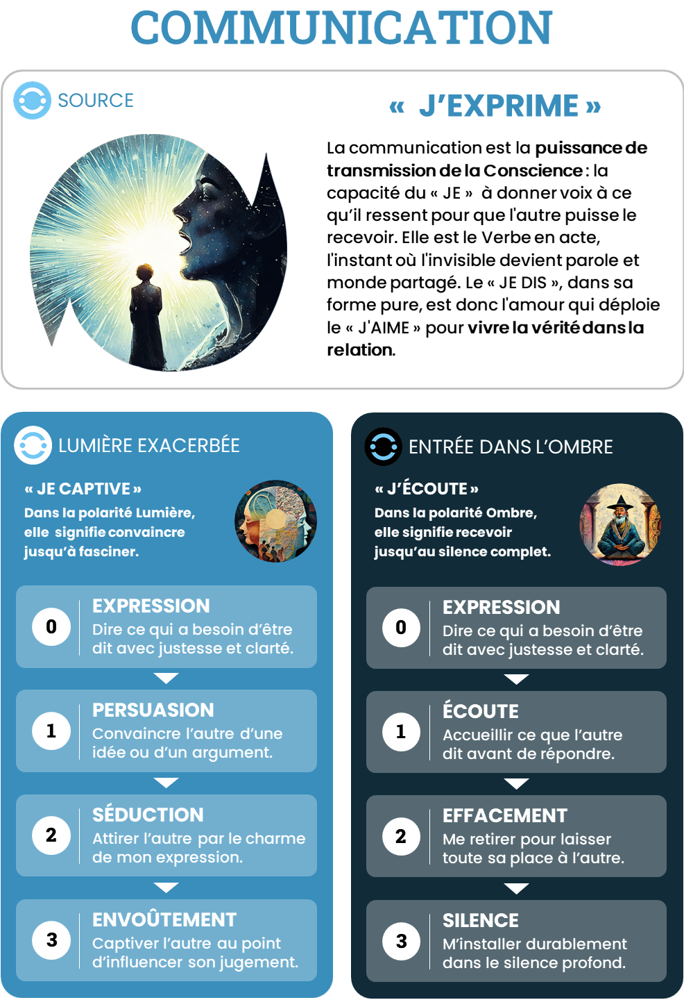

# Communication — J’EXPRIME

## Intensités
| Niveau | Ombre | Lumière |
|---|---|---|
| 1 | Écoute | Persuasion |
| 2 | Effacement | Séduction |
| 3 | Silence | Envoûtement |

## Pouvoirs de l’Ombre
### O1 — Écoute

Recevoir, reformuler, vérifier l’effet et permettre à la réponse d’autrui de transformer sa parole.

### O2 — Effacement

Retirer sa signature pour traduire, éditer, représenter, transmettre et amplifier fidèlement une parole qui ne vient pas de soi.

### O3 — Silence

Suspendre le langage, préserver un secret ou un mystère, laisser mûrir le sens et créer un espace où personne ne capture immédiatement l’expérience.

## Grille synthétique des 27 archétypes

| Amplitude | Bloqué | Intermédiaire | Libre |
|---|---|---|---|
| **O1-L1** | Le Débatteur défensif | Le Dialoguant en éveil | Le Verbe réciproque |
| **O1-L2** | Le Charmeur inquiet | Le Narrateur en réciprocité | Le Charmeur attentif |
| **O1-L3** | Le Tribun captif | L’Orateur en résonance | L’Orateur magnétique |
| **O2-L1** | Le Porte-parole sans voix | Le Messager en affirmation | Le Porte-parole fidèle |
| **O2-L2** | Le Caméléon relationnel | Le Médiateur en incarnation | Le Maïeuticien juste |
| **O2-L3** | Le Miroir ensorcelant | Le Héraut en discernement | Le Porte-Verbe collectif |
| **O3-L1** | Le Silencieux blessé | Le Messager libéré | Le Gardien de l’indicible |
| **O3-L2** | Le Séducteur muet | Le Mystère en ouverture | Le Maître de la présence |
| **O3-L3** | L’Oracle opaque | Le Verbe initiatique | Le Verbe total |

## Descriptions opérationnelles

### O1-L1

- **Bloqué — Le Débatteur défensif** : Écoute surtout pour préparer sa réponse et protéger sa position.
- **Intermédiaire — Le Dialoguant en éveil** : Accepte que la conversation transforme sa pensée.
- **Libre — Le Verbe réciproque** : Parle pour être compris et écoute pour découvrir ce que sa parole ignorait.

### O1-L2

- **Bloqué — Le Charmeur inquiet** : S’adapte aux attentes pour obtenir adhésion et reconnaissance.
- **Intermédiaire — Le Narrateur en réciprocité** : Apprend à toucher sans fabriquer un personnage.
- **Libre — Le Charmeur attentif** : Rend son message désirable tout en restant ouvert à l’effet produit.

### O1-L3

- **Bloqué — Le Tribun captif** : Cherche l’adhésion et vit la contradiction comme une rupture de l’enchantement.
- **Intermédiaire — L’Orateur en résonance** : Apprend que l’impact ne garantit ni vérité ni consentement.
- **Libre — L’Orateur magnétique** : Transforme l’espace par la parole sans réduire l’auditoire au rôle de réceptacle.

### O2-L1

- **Bloqué — Le Porte-parole sans voix** : Sait défendre les autres mais ne formule pas sa propre position.
- **Intermédiaire — Le Messager en affirmation** : Distingue la parole transmise de la parole personnelle.
- **Libre — Le Porte-parole fidèle** : Prête sa voix sans la perdre.

### O2-L2

- **Bloqué — Le Caméléon relationnel** : S’adapte si bien qu’il ne sait plus qui parle en lui.
- **Intermédiaire — Le Médiateur en incarnation** : Traduit sans devenir le produit de la relation.
- **Libre — Le Maïeuticien juste** : Aide l’autre à découvrir et formuler sa propre parole.

### O2-L3

- **Bloqué — Le Miroir ensorcelant** : Renvoie au groupe son propre désir pour capter l’autorité de parler en son nom.
- **Intermédiaire — Le Héraut en discernement** : Apprend à porter un récit collectif sans le posséder.
- **Libre — Le Porte-Verbe collectif** : Donne une voix puissante à une pluralité sans l’effacer.

### O3-L1

- **Bloqué — Le Silencieux blessé** : Retient sa parole parce qu’elle lui semble dangereuse ou impossible à recevoir.
- **Intermédiaire — Le Messager libéré** : Retrouve progressivement une parole longtemps interdite.
- **Libre — Le Gardien de l’indicible** : Sait ce qui doit rester tu et le moment où le silence doit s’ouvrir.

### O3-L2

- **Bloqué — Le Séducteur muet** : Utilise le mystère et l’inaccessibilité pour contrôler la relation.
- **Intermédiaire — Le Mystère en ouverture** : Apprend à devenir lisible sans perdre la profondeur du silence.
- **Libre — Le Maître de la présence** : Communique par le corps, le rythme et des mots rares sans créer de confusion.

### O3-L3

- **Bloqué — L’Oracle opaque** : Alterner parole absolue et silence impénétrable renforce son autorité.
- **Intermédiaire — Le Verbe initiatique** : Apprend à créer et dissoudre les récits sans confondre mystère et pouvoir.
- **Libre — Le Verbe total** : Peut faire naître un monde par la parole puis se taire pour rendre ce monde libre.

## Usage pédagogique

- En état bloqué : ouvrir la possibilité de la polarité évitée sans augmenter immédiatement l’amplitude.
- En état intermédiaire : fournir des ressources explicites, répéter la circulation et préparer le retour au Point Zéro.
- En état libre : élargir l’amplitude ou transférer la capacité dans un contexte plus complexe.
- Une nouvelle intensité peut faire repasser temporairement le joueur de libre à intermédiaire.
