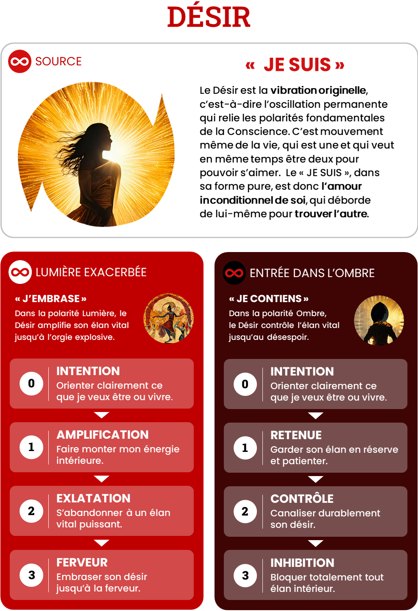

# Desir — JE SUIS

## Intensités
| Niveau | Ombre | Lumière |
|---|---|---|
| 1 | Retenue | Amplification |
| 2 | Contrôle | Exaltation |
| 3 | Extinction / Inhibition | Ferveur |

## Pouvoirs de l’Ombre
### O1 — Retenue

Ralentir, patienter, laisser mûrir et respecter le rythme du vivant.

### O2 — Contrôle

Canaliser durablement l’énergie, la consacrer à une forme ou servir l’élan d’autrui.

### O3 — Extinction

Renoncer, laisser mourir un désir, traverser le vide et rendre l’espace disponible à un nouvel élan.

## Grille synthétique des 27 archétypes

| Amplitude | Bloqué | Intermédiaire | Libre |
|---|---|---|---|
| **O1-L1** | Le Désir sous permission | L’Élan en éveil | Le Gardien du rythme |
| **O1-L2** | Le Célébrant inquiet | Le Funambule du plaisir | Le Célébrant lucide |
| **O1-L3** | Le Feu qui refuse la nuit | Le Porte-Flamme en initiation | Le Porte-Flamme |
| **O2-L1** | Le Désir négocié | L’Élan en réhabilitation | Le Canaliseur vivant |
| **O2-L2** | Le Funambule captif | Le Navigateur du Désir | Le Danseur d’intensité |
| **O2-L3** | Le Volcan corseté | Le Feu en alchimisation | Le Fervent souverain |
| **O3-L1** | Le Désir enseveli | Le Veilleur du retour | Le Gardien du vide fertile |
| **O3-L2** | Le Rebond d’ivresse | Le Phénix en mue | Le Régénérateur du Désir |
| **O3-L3** | Le Brasier affamé | Le Phénix initiatique | Le Vivant total |

## Descriptions opérationnelles

### O1-L1

- **Bloqué — Le Désir sous permission** : N’ose désirer que dans les limites jugées acceptables.
- **Intermédiaire — L’Élan en éveil** : Commence à reconnaître que son désir peut grandir sans devenir dangereux.
- **Libre — Le Gardien du rythme** : Sait faire monter ou ralentir son élan sans en perdre le fil.

### O1-L2

- **Bloqué — Le Célébrant inquiet** : Recherche l’intensité et redoute la baisse d’énergie.
- **Intermédiaire — Le Funambule du plaisir** : Apprend à ralentir sans croire que le désir disparaît.
- **Libre — Le Célébrant lucide** : S’abandonne à l’exaltation puis revient avant la saturation.

### O1-L3

- **Bloqué — Le Feu qui refuse la nuit** : Confond la fin d’un cycle avec la trahison de son appel.
- **Intermédiaire — Le Porte-Flamme en initiation** : Apprend à déposer temporairement sa ferveur sans la renier.
- **Libre — Le Porte-Flamme** : Peut consacrer toute son énergie puis contenir son feu quand le contexte l’exige.

### O2-L1

- **Bloqué — Le Désir négocié** : Ne s’autorise à vouloir qu’après avoir obtenu une légitimité extérieure.
- **Intermédiaire — L’Élan en réhabilitation** : Réapprend à donner de la place à un désir longtemps contrôlé.
- **Libre — Le Canaliseur vivant** : Concentre l’énergie sans la mutiler et sait la réamplifier.

### O2-L2

- **Bloqué — Le Funambule captif** : Alterne exaltation, culpabilité et reprise en main.
- **Intermédiaire — Le Navigateur du Désir** : Reconnaît le cycle mais dépend encore de repères extérieurs.
- **Libre — Le Danseur d’intensité** : Choisit quand s’abandonner et quand contenir.

### O2-L3

- **Bloqué — Le Volcan corseté** : Maintient une ferveur extrême sous une pression de contrôle.
- **Intermédiaire — Le Feu en alchimisation** : Commence à transformer le contrôle en canal de métamorphose.
- **Libre — Le Fervent souverain** : Met une discipline profonde au service d’une ferveur totale.

### O3-L1

- **Bloqué — Le Désir enseveli** : Ne se conçoit plus comme capable de vouloir pleinement.
- **Intermédiaire — Le Veilleur du retour** : Protège les premières étincelles d’un désir qui renaît.
- **Libre — Le Gardien du vide fertile** : Peut ne plus rien vouloir sans perdre le lien à la vie.

### O3-L2

- **Bloqué — Le Rebond d’ivresse** : Compense le vide par des phases d’exaltation.
- **Intermédiaire — Le Phénix en mue** : Reconnaît que l’extinction et la renaissance appartiennent au même cycle.
- **Libre — Le Régénérateur du Désir** : Laisse mourir un ancien élan et accueille une nouvelle exaltation sans reproduire le passé.

### O3-L3

- **Bloqué — Le Brasier affamé** : Oscille entre consumation totale et inhibition.
- **Intermédiaire — Le Phénix initiatique** : Est prêt à embraser et perdre, mais a encore besoin d’un cadre pour traverser.
- **Libre — Le Vivant total** : Peut tout embraser, tout laisser mourir et renaître depuis la Source.

## Usage pédagogique

- En état bloqué : ouvrir la possibilité de la polarité évitée sans augmenter immédiatement l’amplitude.
- En état intermédiaire : fournir des ressources explicites, répéter la circulation et préparer le retour au Point Zéro.
- En état libre : élargir l’amplitude ou transférer la capacité dans un contexte plus complexe.
- Une nouvelle intensité peut faire repasser temporairement le joueur de libre à intermédiaire.
