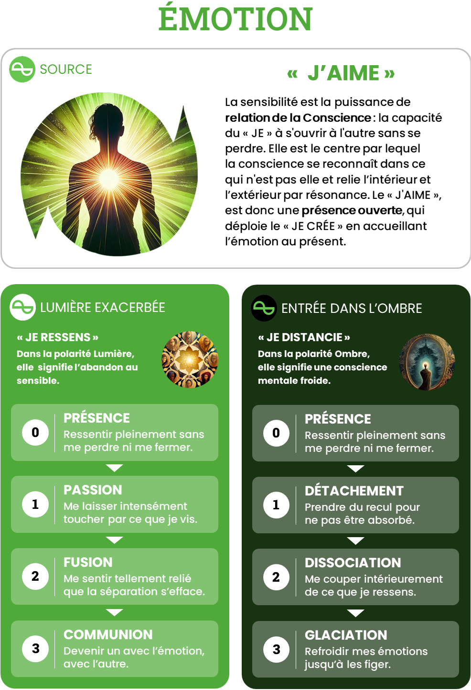

# Emotion — J’AIME

## Intensités
| Niveau | Ombre | Lumière |
|---|---|---|
| 1 | Détachement | Passion |
| 2 | Dissociation | Fusion |
| 3 | Glaciation | Communion |

## Pouvoirs de l’Ombre
### O1 — Détachement

Prendre perspective, différer la réaction et ressentir sans être emporté.

### O2 — Dissociation

Séparer les flux émotionnels, contenir autrui, tenir un cadre et revenir ensuite intégrer son propre ressenti.

### O3 — Glaciation

Suspendre radicalement la résonance pour demeurer opérant, protéger le système et traverser l’insupportable sans fermer définitivement le cœur.

## Grille synthétique des 27 archétypes

| Amplitude | Bloqué | Intermédiaire | Libre |
|---|---|---|---|
| **O1-L1** | Le Sensible sous contrôle | Le Cœur en apprivoisement | Le Témoin sensible |
| **O1-L2** | L’Empathe inquiet | L’Empathe en différenciation | L’Empathe ancré |
| **O1-L3** | Le Cœur sans rivage | L’Amoureux océanique en ancrage | Le Cœur océanique |
| **O2-L1** | Le Fonctionnel anesthésié | Le Cœur dégelé | Le Contenant sensible |
| **O2-L2** | Le Sauveur alternant | Le Régulateur en alchimisation | Le Régulateur empathique |
| **O2-L3** | Le Sauveur universel | Le Grand Cœur en discernement | Le Gardien de la communion |
| **O3-L1** | La Machine mentale | Le Veilleur du dégel | Le Veilleur impassible |
| **O3-L2** | L’Amant polaire | Le Cœur en résurrection | Le Régénérateur affectif |
| **O3-L3** | Le Cœur apocalyptique | L’Amant initiatique | Le Cœur total |

## Descriptions opérationnelles

### O1-L1

- **Bloqué — Le Sensible sous contrôle** : Surveille l’intensité de ce qui le touche.
- **Intermédiaire — Le Cœur en apprivoisement** : Apprend que le recul n’exige pas de couper l’expérience.
- **Libre — Le Témoin sensible** : Ressent et conserve l’espace nécessaire pour répondre justement.

### O1-L2

- **Bloqué — L’Empathe inquiet** : Absorbe les émotions et ne se détache qu’après saturation.
- **Intermédiaire — L’Empathe en différenciation** : Apprend que tout ce qu’il ressent ne lui appartient pas.
- **Libre — L’Empathe ancré** : Peut sentir avec l’autre sans devenir l’autre.

### O1-L3

- **Bloqué — Le Cœur sans rivage** : Confond distance et disparition de l’amour.
- **Intermédiaire — L’Amoureux océanique en ancrage** : Apprend à revenir à lui après une ouverture totale.
- **Libre — Le Cœur océanique** : Peut communier profondément puis retrouver sa singularité.

### O2-L1

- **Bloqué — Le Fonctionnel anesthésié** : Compartimente l’affect pour rester efficace et ne revient pas le chercher.
- **Intermédiaire — Le Cœur dégelé** : Rouvre progressivement l’accès à sa sensibilité.
- **Libre — Le Contenant sensible** : Suspend son affect pour tenir un cadre puis revient l’intégrer.

### O2-L2

- **Bloqué — Le Sauveur alternant** : Fusionne avec la souffrance puis coupe brutalement.
- **Intermédiaire — Le Régulateur en alchimisation** : Apprend à contenir sans absorber ni se fermer.
- **Libre — Le Régulateur empathique** : Rejoint la tempête émotionnelle et aide à revenir sur la rive.

### O2-L3

- **Bloqué — Le Sauveur universel** : Porte la souffrance du monde en ignorant ses propres limites.
- **Intermédiaire — Le Grand Cœur en discernement** : Apprend à aimer largement sans tout porter.
- **Libre — Le Gardien de la communion** : Ouvre le cœur du groupe tout en différenciant et contenant les flux.

### O3-L1

- **Bloqué — La Machine mentale** : A suspendu sa vie émotionnelle au profit du fonctionnement.
- **Intermédiaire — Le Veilleur du dégel** : Laisse revenir quelques émotions sans savoir encore combien accueillir.
- **Libre — Le Veilleur impassible** : Peut atteindre un calme radical puis laisser l’émotion revenir.

### O3-L2

- **Bloqué — L’Amant polaire** : Ne connaît que la fusion totale ou la coupure complète.
- **Intermédiaire — Le Cœur en résurrection** : Traverse l’hiver relationnel sans conclure que le lien est mort.
- **Libre — Le Régénérateur affectif** : Laisse mourir une forme relationnelle et permet au lien de renaître autrement.

### O3-L3

- **Bloqué — Le Cœur apocalyptique** : Oscille entre communion absolue et glaciation totale.
- **Intermédiaire — L’Amant initiatique** : Est prêt à tout ressentir et tout laisser se taire avec accompagnement.
- **Libre — Le Cœur total** : Peut tout ressentir, tout laisser mourir et rouvrir son cœur sans capturer.

## Usage pédagogique

- En état bloqué : ouvrir la possibilité de la polarité évitée sans augmenter immédiatement l’amplitude.
- En état intermédiaire : fournir des ressources explicites, répéter la circulation et préparer le retour au Point Zéro.
- En état libre : élargir l’amplitude ou transférer la capacité dans un contexte plus complexe.
- Une nouvelle intensité peut faire repasser temporairement le joueur de libre à intermédiaire.
