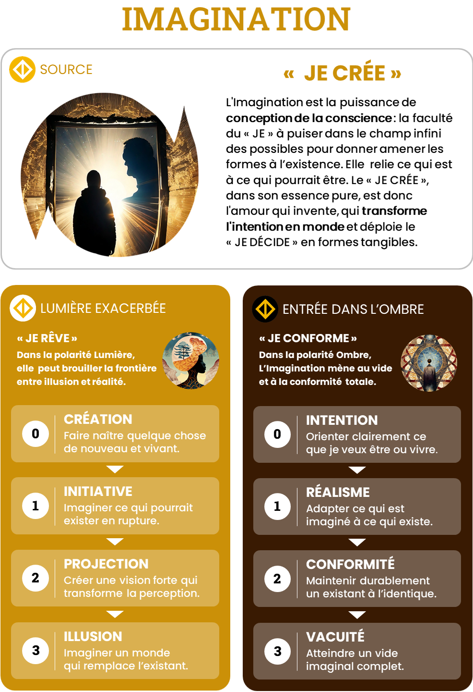

# Imagination — JE CRÉE

## Intensités
| Niveau | Ombre | Lumière |
|---|---|---|
| 1 | Réalisme | Initiative |
| 2 | Conformité | Projection |
| 3 | Vacuité | Illusion |

## Pouvoirs de l’Ombre
### O1 — Réalisme

Confronter une image aux contraintes, prototyper et trouver les conditions concrètes de son incarnation.

### O2 — Conformité

Servir une vision, la formaliser, la documenter, la stabiliser, en garantir la qualité et la déployer à l’échelle.

### O3 — Vacuité

Suspendre ses propres images, recevoir l’imaginaire d’autrui, dissoudre les formes mortes et redevenir matrice.

## Grille synthétique des 27 archétypes

| Amplitude | Bloqué | Intermédiaire | Libre |
|---|---|---|---|
| **O1-L1** | Le Créateur sous tutelle | L’Explorateur du possible | L’Inventeur pragmatique |
| **O1-L2** | Le Visionnaire sous réserve | Le Prophète en incarnation | Le Prophète ancré |
| **O1-L3** | Le Démiurge hors-sol | Le Faiseur de mondes en apprentissage | Le Faiseur de mondes |
| **O2-L1** | L’Innovateur autorisé | L’Intégrateur en émancipation | L’Intégrateur créatif |
| **O2-L2** | Le Réformateur circulaire | L’Architecte en mutation | L’Architecte systémique |
| **O2-L3** | Le Prophète institutionnel | Le Fondateur en discernement | Le Bâtisseur de civilisation |
| **O3-L1** | Le Rêveur desséché | Le Réceptacle en éveil | L’Accoucheur du possible |
| **O3-L2** | Le Mirage du néant | Le Passeur en initiation | Le Traducteur de visions |
| **O3-L3** | Le Faussaire cosmique | Le Démiurge initiatique | La Matrice des Mondes |

## Descriptions opérationnelles

### O1-L1

- **Bloqué — Le Créateur sous tutelle** : Réduit ses idées jusqu’à ce qu’elles ne dérangent plus l’existant.
- **Intermédiaire — L’Explorateur du possible** : Teste des ruptures avec un cadre qui autorise l’erreur.
- **Libre — L’Inventeur pragmatique** : Utilise les contraintes comme matière de création.

### O1-L2

- **Bloqué — Le Visionnaire sous réserve** : Porte une vision forte mais redoute sa confrontation au réel.
- **Intermédiaire — Le Prophète en incarnation** : Accepte de découper, tester et amender sa vision.
- **Libre — Le Prophète ancré** : Garde l’horizon ouvert tout en construisant le premier pont.

### O1-L3

- **Bloqué — Le Démiurge hors-sol** : Utilise le réel pour crédibiliser un univers qui ne se laisse plus contredire.
- **Intermédiaire — Le Faiseur de mondes en apprentissage** : Apprend à créer des portes d’entrée et des limites à son univers.
- **Libre — Le Faiseur de mondes** : Habite un monde imaginal total sans le confondre avec le réel partagé.

### O2-L1

- **Bloqué — L’Innovateur autorisé** : Innove seulement à l’intérieur des normes dominantes.
- **Intermédiaire — L’Intégrateur en émancipation** : Apprend à rompre avec les règles qui protègent la répétition.
- **Libre — L’Intégrateur créatif** : Fait absorber durablement une innovation par le système.

### O2-L2

- **Bloqué — Le Réformateur circulaire** : Annonce le changement avec les catégories mêmes de l’ancien système.
- **Intermédiaire — L’Architecte en mutation** : Reconnaît les anciens plans cachés dans sa nouvelle vision.
- **Libre — L’Architecte systémique** : Transforme une vision en méthodes, rôles, normes et processus évolutifs.

### O2-L3

- **Bloqué — Le Prophète institutionnel** : Institutionnalise un récit qui finit par protéger l’ordre existant.
- **Intermédiaire — Le Fondateur en discernement** : Cherche des contre-récits et des mécanismes d’évolution.
- **Libre — Le Bâtisseur de civilisation** : Traduit un univers symbolique en culture, institutions et infrastructures transmissibles.

### O3-L1

- **Bloqué — Le Rêveur desséché** : Ne voit plus à quoi pourrait ressembler un autre monde.
- **Intermédiaire — Le Réceptacle en éveil** : Commence à recevoir des possibles qui ne viennent pas de lui.
- **Libre — L’Accoucheur du possible** : Retire ses propres images afin qu’une possibilité étrangère puisse émerger.

### O3-L2

- **Bloqué — Le Mirage du néant** : Produit des visions grandioses pour échapper au vide imaginal.
- **Intermédiaire — Le Passeur en initiation** : Apprend à demeurer dans l’informe avant de traduire la vision.
- **Libre — Le Traducteur de visions** : Reçoit une vision d’autrui et lui donne une architecture sans la capturer.

### O3-L3

- **Bloqué — Le Faussaire cosmique** : Remplace le vide par des univers qui doivent devenir plus vrais que le monde.
- **Intermédiaire — Le Démiurge initiatique** : Est prêt à créer et laisser mourir, mais apprend encore à ne pas se perdre.
- **Libre — La Matrice des Mondes** : Peut créer, servir, transmettre, dissoudre et recevoir des mondes sans les posséder.

## Usage pédagogique

- En état bloqué : ouvrir la possibilité de la polarité évitée sans augmenter immédiatement l’amplitude.
- En état intermédiaire : fournir des ressources explicites, répéter la circulation et préparer le retour au Point Zéro.
- En état libre : élargir l’amplitude ou transférer la capacité dans un contexte plus complexe.
- Une nouvelle intensité peut faire repasser temporairement le joueur de libre à intermédiaire.
