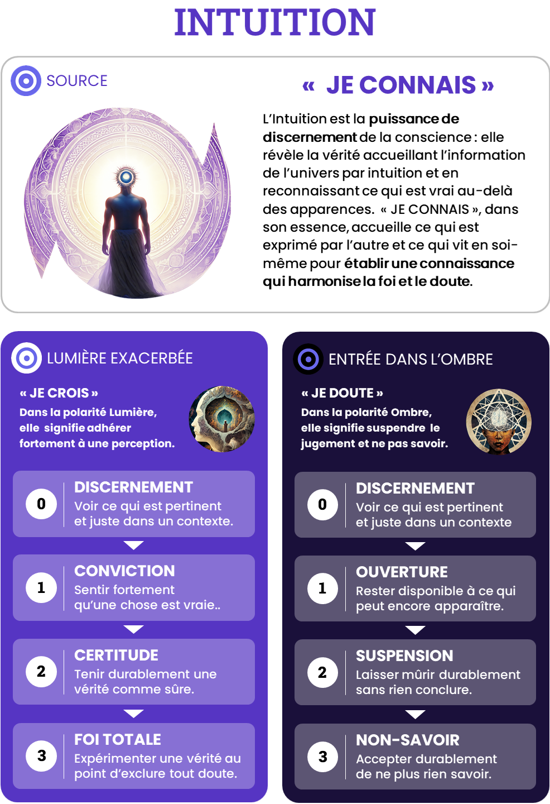

# Intuition — JE CONNAIS

## Intensités
| Niveau | Ombre | Lumière |
|---|---|---|
| 1 | Ouverture | Conviction |
| 2 | Suspension | Certitude |
| 3 | Non-savoir | Foi totale |

## Pouvoirs de l’Ombre
### O1 — Ouverture

Accueillir une anomalie, une hypothèse concurrente ou une information inattendue et mettre à jour son jugement.

### O2 — Suspension

Maintenir plusieurs hypothèses, enquêter, tester, formaliser et transformer une intuition locale en savoir critiquable et transmissible.

### O3 — Non-savoir

Abandonner les cartes, les catégories, l’identité de sachant et même la question afin de rendre possible un changement de paradigme.

## Grille synthétique des 27 archétypes

| Amplitude | Bloqué | Intermédiaire | Libre |
|---|---|---|---|
| **O1-L1** | Le Convaincu conditionnel | L’Explorateur d’hypothèses | L’Éclaireur ouvert |
| **O1-L2** | Le Certain courtois | Le Savant en révision | Le Cartographe vivant |
| **O1-L3** | Le Missionnaire bienveillant | Le Fidèle en dialogue | L’Humble Hiérophante |
| **O2-L1** | L’Enquêteur paralysé | Le Pèlerin des Limbes | L’Enquêteur orienté |
| **O2-L2** | Le Procès sans verdict | Le Discernant initié | Le Cartographe critique |
| **O2-L3** | L’Inquisiteur méthodique | Le Révélateur en discernement | Le Gardien de la vérité vivante |
| **O3-L1** | Le Chercheur perdu | Le Discernant renaissant | Le Veilleur du mystère |
| **O3-L2** | L’Oracle intermittent | Le Sage en déconstruction | Le Passeur de paradigmes |
| **O3-L3** | L’Absolutiste vacillant | Le Prophète initiatique | Le Clairvoyant paisible |

## Descriptions opérationnelles

### O1-L1

- **Bloqué — Le Convaincu conditionnel** : Suit une orientation fragile et change de cap selon les voix les plus assurées.
- **Intermédiaire — L’Explorateur d’hypothèses** : Avance avec une hypothèse sans la confondre avec la vérité.
- **Libre — L’Éclaireur ouvert** : Choisit une direction et reste attentif à ce qu’elle ne permet pas de voir.

### O1-L2

- **Bloqué — Le Certain courtois** : Écoute les objections sans qu’elles modifient réellement son système.
- **Intermédiaire — Le Savant en révision** : Accepte de toucher progressivement aux fondations de sa carte.
- **Libre — Le Cartographe vivant** : Structure et transmet un savoir tout en le maintenant révisable.

### O1-L3

- **Bloqué — Le Missionnaire bienveillant** : Intègre toutes les voies comme étapes vers sa propre vérité.
- **Intermédiaire — Le Fidèle en dialogue** : Conserve sa foi sans nier les expériences irréductibles à son système.
- **Libre — L’Humble Hiérophante** : Témoigne intensément sans universaliser son chemin.

### O2-L1

- **Bloqué — L’Enquêteur paralysé** : Ajoute indéfiniment des hypothèses pour éviter le risque de conclure.
- **Intermédiaire — Le Pèlerin des Limbes** : Tient une longue traversée sans réponse et perçoit un premier fil.
- **Libre — L’Enquêteur orienté** : Suit une piste assez longtemps pour l’éprouver sans prédéterminer le résultat.

### O2-L2

- **Bloqué — Le Procès sans verdict** : Reconstruit sans cesse une certitude plus complexe pour éviter l’incertitude.
- **Intermédiaire — Le Discernant initié** : Distingue ce qu’il sait, suppose et laisse ouvert.
- **Libre — Le Cartographe critique** : Formalise un savoir afin qu’il soit vérifié, contesté et amélioré.

### O2-L3

- **Bloqué — L’Inquisiteur méthodique** : Utilise la recherche pour confirmer une vérité déjà absolue.
- **Intermédiaire — Le Révélateur en discernement** : Soumet sa vision à l’épreuve sans la réduire à une simple opinion.
- **Libre — Le Gardien de la vérité vivante** : Consacre sa vie à un principe tout en critiquant ses formulations et institutions.

### O3-L1

- **Bloqué — Le Chercheur perdu** : Ne sait plus distinguer signe, projection et vérité.
- **Intermédiaire — Le Discernant renaissant** : Retrouve un premier fil sans en faire immédiatement une doctrine.
- **Libre — Le Veilleur du mystère** : Peut ne plus savoir puis accueillir une orientation modeste.

### O3-L2

- **Bloqué — L’Oracle intermittent** : Passe du vide à des certitudes soudaines investies comme absolues.
- **Intermédiaire — Le Sage en déconstruction** : Laisse mourir un paradigme sans précipiter le suivant.
- **Libre — Le Passeur de paradigmes** : Déconstruit une architecture de savoir et rend une nouvelle carte transmissible.

### O3-L3

- **Bloqué — L’Absolutiste vacillant** : Oscille entre foi totale et effondrement de tout sens.
- **Intermédiaire — Le Prophète initiatique** : Est prêt à traverser révélation et nuit du non-savoir avec un cadre exigeant.
- **Libre — Le Clairvoyant paisible** : Peut tout consacrer à une vérité puis abandonner toute prétention à la posséder.

## Usage pédagogique

- En état bloqué : ouvrir la possibilité de la polarité évitée sans augmenter immédiatement l’amplitude.
- En état intermédiaire : fournir des ressources explicites, répéter la circulation et préparer le retour au Point Zéro.
- En état libre : élargir l’amplitude ou transférer la capacité dans un contexte plus complexe.
- Une nouvelle intensité peut faire repasser temporairement le joueur de libre à intermédiaire.
