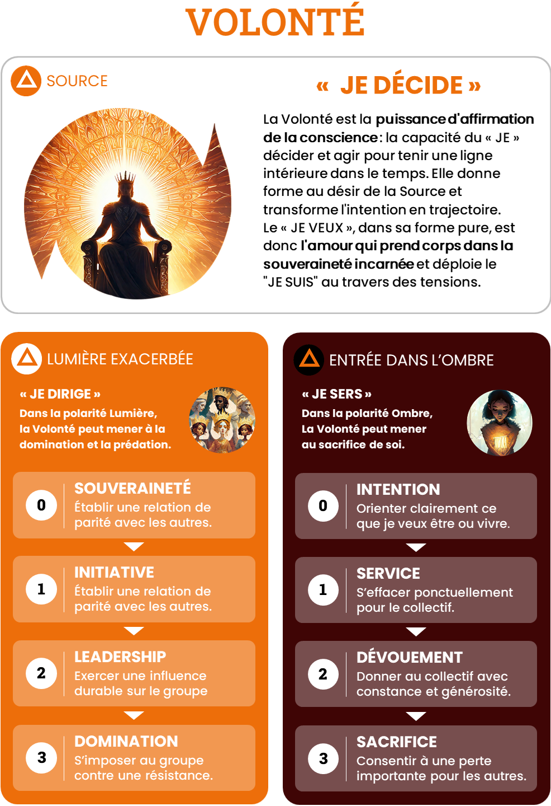

# Volonte — JE DÉCIDE

## Intensités
| Niveau | Ombre | Lumière |
|---|---|---|
| 1 | Service | Initiative |
| 2 | Dévouement | Leadership |
| 3 | Sacrifice | Domination |

## Pouvoirs de l’Ombre
### O1 — Service

Soutenir ponctuellement l’action d’autrui et céder le premier plan sans perdre sa souveraineté.

### O2 — Dévouement

Porter durablement une trajectoire, une responsabilité ou une cause collective.

### O3 — Sacrifice

Consentir à une perte majeure, restituer le pouvoir et offrir sa position sans disparaître intérieurement.

## Grille synthétique des 27 archétypes

| Amplitude | Bloqué | Intermédiaire | Libre |
|---|---|---|---|
| **O1-L1** | Le Bon Élève | L’Allié en éveil | Le Coopérant souverain |
| **O1-L2** | Le Leader défensif | Le Capitaine en apprentissage | Le Leader-serviteur |
| **O1-L3** | Le Protecteur autoritaire | Le Conquérant en pacification | Le Gardien du seuil |
| **O2-L1** | Le Dévoué sans élan | Le Pilier en émergence | Le Pilier discret |
| **O2-L2** | Le Responsable captif | Le Pilote en alchimisation | Le Capitaine solidaire |
| **O2-L3** | Le Croisé du bien commun | Le Stratège en conversion | Le Stratège consacré |
| **O3-L1** | Le Héros épuisé | Le Souverain en résurrection | Le Serviteur du passage |
| **O3-L2** | Le Martyr charismatique | Le Roi blessé en réconciliation | Le Souverain sacrificiel |
| **O3-L3** | Le Tyran sacrificiel | Le Roi initiatique | Le Souverain alchimique |

## Descriptions opérationnelles

### O1-L1

- **Bloqué — Le Bon Élève** : Agit correctement lorsqu’une autorité ou un cadre l’autorise.
- **Intermédiaire — L’Allié en éveil** : Commence à choisir entre initier et soutenir.
- **Libre — Le Coopérant souverain** : Peut ouvrir le chemin ou servir l’initiative d’un autre.

### O1-L2

- **Bloqué — Le Leader défensif** : Dirige pour ne pas redevenir dépendant ou invisible.
- **Intermédiaire — Le Capitaine en apprentissage** : Apprend que servir le groupe ne diminue pas son autorité.
- **Libre — Le Leader-serviteur** : Oriente durablement tout en servant les conditions de contribution des autres.

### O1-L3

- **Bloqué — Le Protecteur autoritaire** : Impose sa vision au nom du bien du groupe.
- **Intermédiaire — Le Conquérant en pacification** : Explore le service sans confondre concession et abdication.
- **Libre — Le Gardien du seuil** : Sait imposer une décision forte puis restituer le pouvoir.

### O2-L1

- **Bloqué — Le Dévoué sans élan** : Trouve sa direction dans les besoins des autres plus que dans sa volonté propre.
- **Intermédiaire — Le Pilier en émergence** : Réhabilite son initiative sous les responsabilités accumulées.
- **Libre — Le Pilier discret** : Porte ce qui doit durer et initie sans rechercher le commandement.

### O2-L2

- **Bloqué — Le Responsable captif** : Dirige et se surresponsabilise jusqu’à devenir indispensable.
- **Intermédiaire — Le Pilote en alchimisation** : Apprend à déléguer sans abandonner le cap.
- **Libre — Le Capitaine solidaire** : Tient la direction et redistribue réellement les responsabilités.

### O2-L3

- **Bloqué — Le Croisé du bien commun** : Justifie sa domination par son dévouement à une cause.
- **Intermédiaire — Le Stratège en conversion** : Distingue progressivement la cause de sa propre vision.
- **Libre — Le Stratège consacré** : Exerce une contrainte forte tout en assumant ses coûts et ses limites.

### O3-L1

- **Bloqué — Le Héros épuisé** : Se sacrifie jusqu’à perdre sa trajectoire personnelle.
- **Intermédiaire — Le Souverain en résurrection** : Réapprend à dire non et à reprendre une initiative propre.
- **Libre — Le Serviteur du passage** : Peut offrir beaucoup puis revenir sans dette ni ressentiment.

### O3-L2

- **Bloqué — Le Martyr charismatique** : Fonde son autorité morale sur sa souffrance et son sacrifice.
- **Intermédiaire — Le Roi blessé en réconciliation** : Cherche une souveraineté qui ne dépende plus de l’endurance.
- **Libre — Le Souverain sacrificiel** : Peut tenir la couronne puis la déposer si la vie du système l’exige.

### O3-L3

- **Bloqué — Le Tyran sacrificiel** : Domine parce qu’il se croit seul capable de porter le fardeau.
- **Intermédiaire — Le Roi initiatique** : Est prêt à tout diriger ou tout abandonner, mais apprend encore à discerner.
- **Libre — Le Souverain alchimique** : Peut prendre le pouvoir sans le posséder et tout donner sans disparaître.

## Usage pédagogique

- En état bloqué : ouvrir la possibilité de la polarité évitée sans augmenter immédiatement l’amplitude.
- En état intermédiaire : fournir des ressources explicites, répéter la circulation et préparer le retour au Point Zéro.
- En état libre : élargir l’amplitude ou transférer la capacité dans un contexte plus complexe.
- Une nouvelle intensité peut faire repasser temporairement le joueur de libre à intermédiaire.
