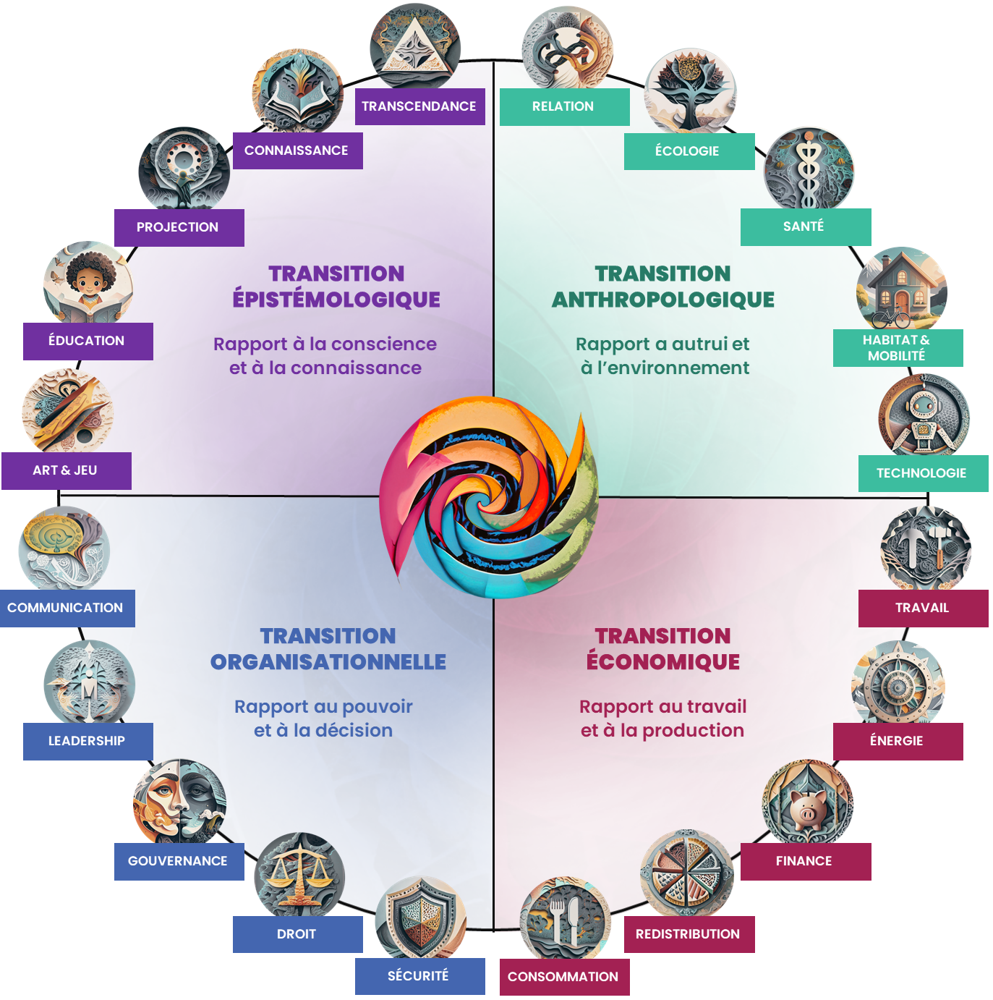
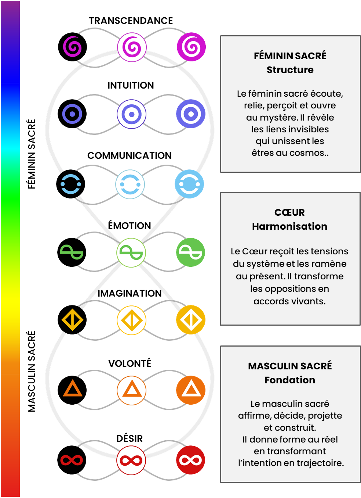

# Verticales civilisationnelles, organisations et Commun

## 1. Les vingt verticales



### Transition épistémologique

Art & Jeu, Éducation, Projection, Connaissance, Transcendance.

### Transition anthropologique

Relation, Écologie, Santé, Habitat & Mobilité, Technologie.

### Transition organisationnelle

Communication, Leadership, Gouvernance, Droit, Sécurité.

### Transition économique

Travail, Énergie, Finance, Redistribution, Consommation.

Une verticale est un **terrain d’application** du Moteur, non une discipline séparée.

## 2. Exemple de correspondances

| Verticale | Puissances dominantes possibles |
|---|---|
| Éducation | Imagination, Communication, Intuition |
| Leadership | Volonté, Émotion, Communication |
| Écologie | Désir, Émotion, Transcendance |
| Technologie | Imagination, Intuition, Volonté |
| Finance | Volonté, Intuition, Transcendance |
| Art & Jeu | Désir, Imagination, Émotion |
| Gouvernance | Volonté, Émotion, Communication |
| Redistribution | Désir, Volonté, Transcendance |

## 3. Masculin, Cœur et Féminin



### Masculin sacré — Fondation

Désir, Volonté, Imagination.

```text
Désirer → décider → créer
```

### Cœur — Harmonisation

Émotion. Elle reçoit les tensions du système, les ramène au présent et transforme les oppositions en accords vivants.

### Féminin sacré — Structure relationnelle

Communication, Intuition, Transcendance.

```text
Écouter → connaître → relier
```

Les parcours transversaux peuvent travailler l’Alliance : initier et accueillir, construire et laisser émerger, décider et écouter, maîtriser et lâcher prise.

## 4. L’organisation comme Moteur collectif

| Puissance | Expression organisationnelle |
|---|---|
| Désir | raison d’être, ambition, pulsion de croissance |
| Volonté | pouvoir, décision, leadership |
| Imagination | vision, innovation, stratégie |
| Émotion | culture, confiance, tensions |
| Communication | coordination, récit, information |
| Intuition | apprentissage, signaux faibles, discernement |
| Transcendance | contribution, impact, transmission et redistribution |

## 5. Besoins et cadres capacitants

| Puissance | Besoin individuel | Cadre collectif |
|---|---|---|
| Volonté | Reconnaissance | Relationnel |
| Imagination | Impact | Sens |
| Émotion | Sécurité | Gouvernance |
| Communication | Liberté | Opérationnel |
| Intuition | Évolution | Apprenance |

Le Désir met l’ensemble en mouvement. La Transcendance redistribue la valeur générée.

## 6. Familles de parcours organisationnels

- Lire l’organisation comme un Moteur.
- Diagnostiquer les cinq cadres.
- Identifier Parti Conformé et Parti Réprimé.
- Transformer les relations et les conflits.
- Transformer le pouvoir et les contre-pouvoirs.
- Aligner vision et opérations.
- Capitaliser les pratiques et apprendre des erreurs.
- Passer de la performance à la valeur vivante.
- Devenir une Chrysalide civilisationnelle.

## 7. Commun Point Zéro

Le Commun est un catalogue intégratif de méthodes, outils, jeux, ateliers, diagnostics, protocoles, parcours, modèles de gouvernance et systèmes de redistribution.

### Degrés de relation au Commun

1. **Découvrir** — comprendre l’intention et les conditions d’usage.
2. **Utiliser** — appliquer dans une situation simple.
3. **Faciliter** — tenir le cadre, gérer les écarts et adapter avec discernement.
4. **Transmettre et enrichir** — former, documenter, améliorer et redistribuer.

### Rôles possibles

Praticien, facilitateur, formateur, contributeur, gardien du Commun.

## 8. Passage à l’échelle

Le passage à l’échelle ne signifie pas seulement augmenter le nombre de participants. Il peut consister à :

- formaliser une pratique ;
- la rendre reproductible ;
- maintenir sa qualité ;
- former des facilitateurs ;
- documenter les variantes ;
- créer une gouvernance de la méthode ;
- partager la valeur ;
- permettre l’essaimage sans centralisation excessive.
