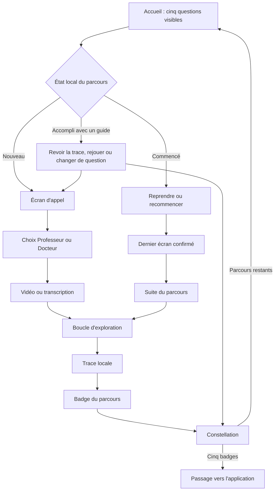

# Wireflows mobiles des parcours publics

> **Ajout Codex — 2026-08-03 · Spécification UX basse fidélité à destination de Claude.**
>
> **Statut** : traduction prototypable des cinq storyboards de
> [parcours-publics-sas.md](https://github.com/PointZero2050/zegame-docs/blob/main/docs/site/parcours-publics-sas.md).
> Ce document fixe la navigation, les patrons d'écran, les états et les sorties. Il ne fixe
> ni les illustrations finales, ni les animations détaillées, ni l'architecture Rails.
>
> **Cible de référence** : mobile 360 × 800 px, utilisable d'une seule main, puis adaptation
> progressive à 390 px, tablette et ordinateur.

---

## 1. Principe : une grammaire, cinq expériences

Les cinq parcours doivent sembler appartenir au même Sas sans devenir cinq questionnaires
habillés différemment.

La stabilité porte sur :

- l'entrée, le choix du guide et la sortie ;
- la position de la progression et de l'action principale ;
- la façon de choisir, confirmer, comprendre et revenir en arrière ;
- les états de sauvegarde, reprise, accomplissement et rejeu ;
- les composants de vidéo, de révélation, de trace et de badge.

La variation porte sur :

- la scène centrale ;
- les pièces manipulées ;
- le rythme des révélations ;
- les métaphores propres à chaque question ;
- la voix du Professeur ou du Docteur.

Le prototype doit d'abord prouver que le parcours se comprend en niveaux de gris. Couleurs,
textures et illustrations viennent ensuite.

---

## 2. Flux global du Sas



Le retour arrière ne doit jamais effacer silencieusement une décision confirmée. Lorsqu'un
choix ancien invalide des écrans suivants, une modale sobre prévient :

> Modifier ce choix recalculera la suite de cette partie. Ta trace précédente restera visible
> jusqu'à la prochaine validation.

---

## 3. Coque mobile commune

### 3.1 Découpage vertical

```text
┌──────────────────────────────────┐
│ ×   Question courte       4 / 13 │  En-tête 48 px
│ ━━━━━━━━━━━●━━━━━━━━━━━━━━━━━━━ │  Progression
├──────────────────────────────────┤
│                                  │
│       scène / vidéo / jeu        │  Zone principale flexible
│                                  │
│  titre d'étape                   │
│  consigne ou retour              │
│  choix manipulables              │
│                                  │
├──────────────────────────────────┤
│ [ Action principale explicite ]  │  Barre d'action fixe
│    action secondaire discrète    │  + zone sûre système
└──────────────────────────────────┘
```

Règles :

- l'en-tête reste visible, mais peut se réduire pendant une vidéo ;
- la progression indique un chemin, jamais une note ;
- la zone principale scrolle verticalement si nécessaire ;
- la barre d'action reste fixe uniquement quand elle ne masque aucun contenu ni contrôle ;
- un écran possède une seule action principale ;
- l'action principale nomme le geste réel : « Choisir ce guide », « Confirmer la
  répartition », « Conserver cette trace » ; jamais « Valider » seul ;
- la croix ouvre `Quitter et conserver / Quitter sans conserver / Continuer` ;
- aucune navigation générale du site n'est affichée pendant l'exploration.

### 3.2 Progression

Le libellé `4 / 13` est accessible aux lecteurs d'écran. La ligne visuelle peut contenir des
seuils discrets : appel, exploration, trace, passage. Elle ne révèle pas les embranchements
narratifs ni le badge caché.

Une étape n'est considérée comme franchie qu'après l'action de confirmation. Faire défiler un
écran ou lancer une vidéo ne suffit pas.

### 3.3 Présence du guide

Après son choix, le guide apparaît uniquement lorsqu'il apporte quelque chose :

- médaillon de 40 à 48 px ;
- cartouche de deux à quatre lignes ;
- bouton `Lire la suite` si le propos est plus long ;
- nom annoncé au lecteur d'écran avant sa réplique.

Le guide ne flotte pas en permanence au-dessus du jeu. Il ne cache ni les pièces ni l'action.
Un tap sur son médaillon rappelle son angle et permet de changer de guide **en recommençant le
parcours**, jamais au milieu d'une même partie.

---

## 4. Patrons d'écran réutilisables

### P1 — Appel

- image ou scène-seuil occupant 40 à 55 % du premier écran ;
- question, promesse en trois lignes maximum, durée ;
- CTA `Entrer dans…` adapté au parcours ;
- retour à l'accueil toujours possible.

### P2 — Choix du guide

Deux cartes de même poids. Chaque carte montre : portrait, nom, angle en une phrase et un court
exemple de ton. Le bouton n'apparaît qu'après sélection. Aucun guide n'est marqué
« recommandé ».

### P3 — Vidéo active

- lecteur 16:9 en pleine largeur utile ;
- bouton lecture central, durée visible avant lancement ;
- sous-titres activés par défaut sans son ;
- transcription immédiatement accessible ;
- CTA suivant actif après lecture complète **ou** confirmation explicite `J'ai terminé la
  transcription` ;
- option `Lire plutôt que regarder` disponible immédiatement, sans perte de badge.

Le suivi n'a pas besoin d'une surveillance à la seconde. Le but est l'acquisition, pas la preuve
forensique d'attention.

### P4 — Choix situé

- une situation concrète ;
- deux à cinq options entièrement lisibles ;
- sélection réversible avant confirmation ;
- aucune couleur « bonne / mauvaise » ;
- retour explicatif après confirmation.

### P5 — Manipulation

Pour classer, répartir ou composer :

- le glisser-déposer est disponible mais jamais obligatoire ;
- un tap sélectionne une pièce, un second tap sa destination ;
- boutons `+ / −` pour toute allocation quantitative ;
- total et reste à affecter toujours visibles ;
- `Annuler mon dernier geste` plutôt qu'une remise à zéro cachée.

### P6 — Révélation

La conséquence se révèle dans la même géographie visuelle que le choix. Le système montre :

1. ce que le geste rend possible ;
2. ce qu'il ne résout pas ;
3. la question suivante.

Il n'affiche ni coche verte, ni croix rouge, ni félicitation automatique.

### P7 — Comparaison ou bifurcation

Deux états restent consultables côte à côte sur grand écran et par bascule `Avant / Après` sur
mobile. La bascule conserve les mêmes positions pour faciliter la comparaison.

### P8 — Trace

- synthèse composée à partir des décisions confirmées ;
- éléments éditables lorsque le sens appartient au visiteur ;
- champ libre toujours facultatif ;
- mention constante `Conservée sur cet appareil` ;
- CTA `Conserver cette trace`.

### P9 — Badge et constellation

- révélation brève, désactivable avec `Réduire les animations` ;
- badge, acquisition formulée en « J'ai… », pas en qualité identitaire absolue ;
- constellation mise à jour ;
- CTA vers une autre question ou vers le passage dans l'application ;
- rejeu avec l'autre guide disponible mais secondaire.

---

## 5. Wireflow — « Qu'arrive-t-il à l'humanité ? »

| ID | Écran | Patron | Action principale | Sortie conservée |
|---|---|---|---|---|
| C01 | L'appel | P1 | Explorer la convergence | aucune |
| C02 | Choix du guide | P2 | Suivre ce guide | `guide` |
| C03 | Vidéo d'ouverture | P3 | Entrer dans les cycles | état vidéo/transcription |
| C04 | Jeu des temporalités | P5 | Confirmer mon classement | ordre intuitif des cartes |
| C05 | Nommer les cinq cycles | P6 | Voir leurs rythmes | associations cycle–temporalité |
| C06 | Faire converger les lignes | P5 | Faire avancer le temps | point de convergence construit |
| C07 | Dix manifestations | P4/P5 | Garder trois signes | trois signes choisis |
| C08 | Un signe, plusieurs niveaux | P6 | Déplier ce signe | lecture multicouche |
| C09 | Ce qui résiste au récit | P4 | Conserver un contre-signe | continuité choisie |
| C10 | Retournement et trace | P8 | Conserver cette trace | hypothèse + contre-signe |
| C11 | Restitution | P7 | Voir ce que j'ai traversé | carte finale |
| C12 | Badge et passage | P9 | Choisir une autre question | badge Décodeur des cycles |

Particularités mobiles :

- C04 : une seule carte temporelle active ; les autres restent en pile compacte ;
- C06 : une seule ligne détaillée à la fois, vue d'ensemble simplifiée en fin d'étape ;
- C07 : les dix manifestations s'affichent par familles de deux, puis les trois choix sont
  réunis ;
- C11 : la convergence, les signes et le contre-signe forment trois panneaux verticaux, pas un
  schéma dense réduit.

---

## 6. Wireflow — « Quels sont les scénarios du futur ? »

| ID | Écran | Patron | Action principale | Sortie conservée |
|---|---|---|---|---|
| F01 | L'appel | P1 | Ouvrir l'Atlas | aucune |
| F02 | Choix du guide | P2 | Suivre ce guide | `guide` |
| F03 | Vidéo d'ouverture | P3 | Explorer les futurs | état vidéo/transcription |
| F04 | Cinq familles | P4 | Entrer dans le présent | famille explorée en premier |
| F05 | Trois signaux | P5 | Conserver ces signaux | trois signaux choisis |
| F06 | Atlas des 25 scénarios | P5 | Composer mon jeu | cinq cartes, une par famille |
| F07 | Une puissance, deux futurs | P7 | Continuer l'exploration | polarité observée |
| F08 | Jeu de futurs | P5 | Confirmer ces cinq cartes | jeu de cinq scénarios |
| F09 | Cinq phases de l'intercycle | P5/P6 | Poser mes cartes dans le temps | trajectoire en cinq phases |
| F10 | Scénario hybride | P5 | Donner forme à ce futur | composition hybride |
| F11 | Ce qui le fait bifurquer | P4 | Conserver ce critère | risque + critère de révision |
| F12 | Restitution | P8 | Conserver cette trace | scénario + signaux + révision |
| F13 | Badge et passage | P9 | Choisir une autre question | badge Prospectiviste |

Particularités mobiles :

- F06 : carrousel accessible avec boutons précédent/suivant ; le swipe reste facultatif ;
- le tiroir de comparaison montre au maximum deux cartes entières ;
- F09 : les cinq phases sont des emplacements horizontaux parcourus un par un, puis résumés en
  une frise verticale ;
- F12 : la restitution ne recompose aucun texte dans les illustrations sources.

---

## 7. Wireflow — « Quelles forces ont façonné nos croyances ? »

| ID | Écran | Patron | Action principale | Sortie conservée |
|---|---|---|---|---|
| P01 | L'appel | P1 | Ouvrir l'enquête | aucune |
| P02 | Choix du guide | P2 | Suivre ce guide | `guide` |
| P03 | Vidéo d'ouverture | P3 | Choisir une pièce | état vidéo/transcription |
| P04 | Pièce à conviction | P4 | Examiner cet objet | objet choisi |
| P05 | Reconnaître la Lumière | P4 | Conserver cet apport | besoin/capacité d'origine |
| P06 | Instruction silencieuse | P4 | Suivre cette instruction | croyance collective proposée |
| P07 | Regard de l'enfant | P4 | Garder cette question | question de naïveté féconde |
| P08 | Arbre de croyance | P5/P6 | Relier les quatre niveaux | chaîne objet–règle–croyance–effet |
| P09 | Alchimiser | P4 | Formuler une nouvelle règle | règle d'usage alternative |
| P10 | Restitution | P8 | Conserver cette trace | arbre simplifié et amendement |
| P11 | Badge et passage | P9 | Choisir une autre question | badge Archéologue des croyances |

Particularités mobiles :

- P04 : une pièce centrale, cinq autres sous forme de miniatures ;
- P08 : révélation verticale par strates, jamais un arbre complet illisible ;
- P09 : les apports initiaux restent visibles pendant la formulation de la nouvelle règle afin
  que l'alchimisation ne ressemble pas à une suppression.

---

## 8. Wireflow — « Qu'est-ce qui nous paralyse ? »

| ID | Écran | Patron | Action principale | Sortie conservée |
|---|---|---|---|---|
| L01 | L'appel | P1 | Entrer dans la situation | aucune |
| L02 | Choix du guide | P2 | Suivre ce guide | `guide` |
| L03 | Vidéo d'ouverture | P3 | Prendre les leviers | état vidéo/transcription |
| L04 | Situation | P4 | Agir sur cette ville | scène sélectionnée |
| L05 | Cinq leviers, dix jetons | P5 | Confirmer ma répartition | allocation initiale |
| L06 | Premiers effets | P6/P7 | Observer la suite | effet à court terme |
| L07 | Retour de l'angle mort | P6 | Accueillir cette limite | levier dominant + angle mort |
| L08 | Second tour | P5 | Ajouter un second levier | alliance de leviers |
| L09 | Cinq lectures | P6 | Déplier les cinq profondeurs | correspondances révélées |
| L10 | Autre scène, deux leviers | P4/P5 | Confronter cette alliance | choix de transfert |
| L11 | Trace | P8 | Conserver cette trace | alliance + tension |
| L12 | Restitution | P7 | Voir les effets reliés | carte avant/après/angle mort |
| L13 | Badge et passage | P9 | Choisir une autre question | badge Changeur d'échelle |

Particularités mobiles :

- L05 : les cinq leviers restent dans une barre compacte ; le compteur `10 à répartir` demeure
  fixé au-dessus du CTA ;
- L06 : la ville conserve le même cadrage dans les états avant et après ;
- L09 : aucune représentation en escalier ou niveaux numérotés ;
- L12 : le premier choix, sa limite et le second levier sont consultables sans changer de page.

---

## 9. Wireflow — « Comment nous réveiller ? »

| ID | Écran | Patron | Action principale | Sortie conservée |
|---|---|---|---|---|
| R01 | L'appel | P1 | Entrer dans la Maison des futurs | aucune |
| R02 | Choix du guide | P2 | Suivre ce guide | `guide` |
| R03 | Vidéo d'ouverture | P3 | Observer ce qui bloque | état vidéo/transcription |
| R04 | Projet immobile | P4 | Commencer par ce blocage | premier symptôme |
| R05 | Premier circuit | P4/P6 | Ouvrir ce circuit | premier geste Puissance–Cadre |
| R06 | Quatre autres circuits | P4/P6 | Relier les cinq circuits | quatre gestes suivants |
| R07 | Moteur collectif | P5/P6 | Poser deux garde-fous | équilibre sous accélération |
| R08 | Pourquoi le Cercle ? | P6 | Voir circuler les fonctions | cinq fonctions légères |
| R09 | Une autre circulation | P6 | Essayer l'orientation | compréhension Ω/Fonds/capacité |
| R10 | Orienter sans posséder | P5 | Confirmer cette orientation fictive | répartition de 500 € |
| R11 | Refermer la boucle | P6/P7 | Voir ce qui revient au Commun | effets + tension |
| R12 | Trace | P8 | Conserver cette trace | circuits + orientation + possibilité |
| R13 | Badge et passage | P9 | Choisir la suite | badge Réactivateur de Puissances |

Particularités mobiles :

- R06 : une seule scène active ; les cinq circuits s'allument dans une miniature persistante ;
- R07 : chaque circuit possède un glyphe en plus de sa couleur ;
- R09–R10 : deux compteurs sont toujours affichés sur des lignes séparées : `5 Ω actifs` reste
  fixe, `500 € à orienter` diminue ;
- aucun geste graphique ne déplace un Ω vers un projet ; seuls les euros circulent ;
- R11 : le retour au Commun est une boucle d'argent, pas une récompense en Omégas.

En R13, `Choisir la suite` devient `Faire passer mes traces dans le Jeu` uniquement si les cinq
badges visibles sont réunis. Sinon, l'action principale renvoie aux questions restantes.

---

## 10. États de l'accueil et reprise

Chaque carte de parcours possède quatre états publics :

| État | Information visible | Action principale |
|---|---|---|
| Nouveau | promesse + durée | Commencer |
| En cours | guide + dernière étape confirmée + progression approximative | Reprendre |
| Accompli une fois | badge + guide utilisé | Revoir ma trace |
| Accompli avec les deux guides | deux petits signes de guide, sans annoncer le secret global | Rejouer |

Lors d'un retour sur le site, un bandeau non bloquant peut annoncer :

> Tes traces sont toujours ici. Tu peux reprendre « Quels sont les scénarios du futur ? » ou
> choisir une autre question.

Il ne déclenche aucune reprise automatique. Le visiteur garde la main.

---

## 11. Contrat de persistance locale

Le prototype peut utiliser un objet local versionné par navigateur :

```text
schema_version
visitor_local_id
path_slug
guide_slug
last_confirmed_screen
started_at
updated_at
completed_at
choices
trace
badge
completed_guides
import_status
```

Règles :

- sauvegarder après chaque confirmation, jamais pendant une hésitation ;
- ne pas stocker le contenu vidéo ni les données techniques inutiles ;
- conserver les traces pendant plusieurs mois ; **180 jours** constitue une hypothèse de
  prototype à confirmer, pas une décision juridique ;
- rendre disponible sur l'accueil `Voir et effacer mes traces locales` ;
- ne jamais envoyer ces données au serveur avant consentement explicite ;
- au passage vers l'application, afficher précisément les cinq badges, choix et textes qui
  seront importés ;
- permettre `Continuer sans importer` et `Annuler` ;
- après import réussi, conserver une copie locale marquée `importée` jusqu'à ce que le visiteur
  choisisse de l'effacer.

Le stockage local ne doit contenir aucune inférence de personnalité, de Puissance, de niveau de
conscience ou d'orientation politique.

---

## 12. Passage vers l'application

Lorsque les cinq badges visibles sont réunis, la constellation change d'état sans prétendre que
le visiteur a achevé le Monde 0.

Séquence :

1. la constellation complète apparaît ;
2. une invitation explique la différence entre fragments publics et transformation dans le
   Jeu ;
3. CTA `Faire passer mes traces dans le Jeu` ;
4. création de compte ou connexion dans l'application ;
5. écran de consentement listant les données importées ;
6. confirmation ;
7. retour vers l'expérience « Le site du Point Zéro » ou le point d'entrée du Monde 0.

Le **Passeur du Seuil** n'est pas attribué par le site. Le Sas rassemble les fragments ; le rite
de passage dans l'application leur donne un statut dans le Jeu.

Une erreur d'import ne supprime jamais la copie locale. Le bouton de reprise indique clairement
si l'import est en attente, réussi ou à recommencer.

---

## 13. Accessibilité et usage réel

- zones tactiles de 44 × 44 px minimum ;
- aucun geste horizontal ou glisser-déposer indispensable ;
- focus clavier suivant l'ordre visuel ;
- titres d'étapes annoncés au changement d'écran ;
- conséquences dynamiques annoncées dans une zone `aria-live` non intrusive ;
- couleurs doublées par formes, glyphes et libellés ;
- sous-titres, transcription et commandes accessibles pour toutes les vidéos ;
- mode mouvement réduit : aucune convergence, carte ou badge ne dépend d'une animation ;
- tailles de texte compatibles avec un agrandissement à 200 % ;
- pas de minuterie, de classement ni de pression à répondre vite ;
- connexion interrompue : les écrans déjà chargés et les choix locaux ne sont pas perdus ;
- un parcours peut être interrompu puis repris au dernier écran **confirmé**.

---

## 14. Critères d'acceptation du prototype basse fidélité

Le wireflow est prêt pour une passe visuelle si :

1. les cinq parcours sont jouables de l'accueil à la constellation en 360 px sans débordement
   horizontal ;
2. une personne comprend toujours ce qu'elle doit faire sans explication orale ;
3. aucun écran n'expose deux actions principales concurrentes ;
4. toute manipulation au drag possède une alternative au tap ou aux boutons ;
5. retour, sortie, reprise et recommencement ne détruisent aucune trace sans avertissement ;
6. le changement de guide produit un rejeu explicite, pas une bifurcation invisible ;
7. chaque conséquence reste reliée au choix qui l'a produite ;
8. les traces sont consultables et effaçables localement ;
9. le transfert vers l'application demande un consentement informé ;
10. la simulation Oméga garde le compteur Ω immobile pendant que le montant en euros évolue ;
11. vidéo et transcription permettent la même progression ;
12. les cinq parcours gardent une syntaxe commune sans perdre leur mécanique propre.

### Test utilisateur minimal

Faire tester d'abord deux parcours contrastés — **scénarios** et **réveil** — auprès de cinq
personnes :

- une partie sans aucune consigne ;
- observation des retours arrière, hésitations et erreurs de manipulation ;
- mesure de la durée, sans objectif communiqué au testeur ;
- entretien bref sur ce qui a été compris, pas seulement apprécié ;
- vérification spécifique des phrases « une Puissance est… » et « un Oméga permet… » ;
- correction de la coque commune avant de décliner les trois autres parcours en haute fidélité.

---

## 15. Hors périmètre de cette étape

- illustrations, textures, palette finale et animations de marque ;
- scripts vidéo définitifs et tournage ;
- génération libre de conséquences par LLM ;
- diagnostic personnel des Puissances ;
- attribution d'Omégas réels ;
- simulation de la cagnotte d'un Cercle ;
- paiement, crowdfunding ou décision financière réelle ;
- contenu et condition exacte du parcours caché ;
- implémentation Rails et choix définitif du mécanisme d'import.

La prochaine décision après le prototype basse fidélité porte sur l'architecture du **parcours
caché** : ce qu'il reconnaît, ce qu'il révèle et pourquoi il mérite d'être rejoué selon les deux
angles sans devenir une simple chasse à l'easter egg.
